# Git-Learning
<div align="center">

# 🌳 The Complete Git & GitHub Mastery Guide

### *From Zero to Version Control Hero*


**A single, self-contained repository that teaches Git and GitHub from absolute first principles to advanced, production-grade workflows.**

`Difficulty: Beginner → Advanced` • `Estimated Reading Time: ~3.5 hours (full read) / 10 min (cheat sheet only)` • `Format: GitHub Flavored Markdown`

[📖 Start Learning](#-1-introduction-to-version-control--git) · [⚡ Cheat Sheet](#-32-cheat-sheets) · [🧭 Real-World Scenarios](#-34-real-world-scenarios) · [❓ FAQ / Troubleshooting](#-30-troubleshooting)

</div>

---

## 🧾 About This Repository

> **📌 Note**
> This README is designed to work both as a **linear tutorial** (read top to bottom) and as a **reference manual** (jump straight to the command you need via the Table of Contents). Every command is explained with *why it exists*, *when to use it*, and *what can go wrong*.

### ✨ What You'll Get

| 🎯 Feature | 📋 Description |
|---|---|
| **Full Command Coverage** | Every day-to-day and advanced Git command, explained with syntax, options, and real examples |
| **Visual Learning** | Mermaid diagrams, ASCII trees, and flowcharts for every core concept |
| **GitHub Deep Dive** | Issues, PRs, Actions, Projects, Pages, Codespaces, Dependabot, and more |
| **Real Workflows** | Git Flow, GitHub Flow, Trunk-Based Development, monorepo strategy |
| **Recovery Toolkit** | How to undo *any* mistake — resets, reflog, cherry-pick recovery, lost commits |
| **Cheat Sheets** | Printable quick-reference tables for daily use |
| **Interview Prep** | Beginner → Advanced Git interview questions with model answers |

### 🗺️ Suggested Learning Path

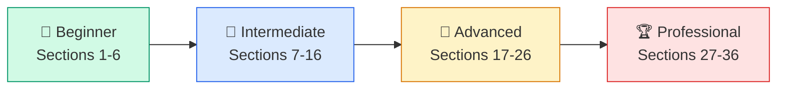

| Track | Who it's for | Sections |
|---|---|---|
| 🌱 **Beginner** | Never used Git before | 1 – 6 |
| 🌿 **Intermediate** | Comfortable with add/commit/push | 7 – 16 |
| 🌳 **Advanced** | Wants deep internals & GitHub power features | 17 – 26 |
| 🏆 **Professional** | Wants team workflows, CI/CD, best practices | 27 – 36 |

---

## 📚 Table of Contents

<details open>
<summary><strong>Click to expand / collapse full Table of Contents</strong></summary>

- [🧾 About This Repository](#-about-this-repository)
- [📚 1. Introduction to Version Control & Git](#-1-introduction-to-version-control--git)
- [⚙️ 2. Installation](#-2-installation)
- [🔧 3. Configuration](#-3-configuration)
- [📁 4. Creating Repositories](#-4-creating-repositories)
- [🔁 5. Basic Workflow](#-5-basic-workflow)
- [🌿 6. Branching](#-6-branching)
- [🔀 7. Merging](#-7-merging)
- [🧬 8. Rebasing](#-8-rebasing)
- [☁️ 9. Remote Repositories](#-9-remote-repositories)
- [🏷️ 10. Tags](#-10-tags)
- [↩️ 11. Undo Operations](#-11-undo-operations)
- [🔍 12. Searching Git History](#-12-searching-git-history)
- [📜 13. Git History & Log Formatting](#-13-git-history--log-formatting)
- [🧠 14. Git Internals](#-14-git-internals)
- [🪝 15. Git Hooks](#-15-git-hooks)
- [🚫 16. .gitignore](#-16-gitignore)
- [🐙 17. GitHub Deep Dive](#-17-github-deep-dive)
- [📦 18. Git LFS](#-18-git-lfs-large-file-storage)
- [🧩 19. Submodules](#-19-submodules)
- [🌲 20. Subtree](#-20-subtree)
- [🌴 21. Worktrees](#-21-worktrees)
- [🎯 22. Sparse Checkout](#-22-sparse-checkout)
- [🧹 23. Git Maintenance](#-23-git-maintenance)
- [🔐 24. Authentication & Signing](#-24-authentication--signing)
- [🚀 25. Advanced Git](#-25-advanced-git)
- [⚡ 26. Git Performance](#-26-git-performance)
- [🤝 27. Collaboration Workflows](#-27-collaboration-workflows)
- [🔄 28. CI/CD Integration](#-28-cicd-integration)
- [✅ 29. Best Practices](#-29-best-practices)
- [🛠️ 30. Troubleshooting](#-30-troubleshooting)
- [🎤 31. Interview Questions](#-31-interview-questions)
- [🗒️ 32. Cheat Sheets](#-32-cheat-sheets)
- [📊 33. Visual Diagrams](#-33-visual-diagrams)
- [🎬 34. Real-World Scenarios](#-34-real-world-scenarios)
- [🔗 35. Resources](#-35-resources)
- [👤 36. Author](#-36-author)

</details>

---

## 📚 1. Introduction to Version Control & Git

### 1.1 What Is Version Control?

**Version control** is a system that records changes to files over time so you can recall specific versions later. Without it, teams resort to folders like `project_final_v2_FINAL_reallyfinal.docx` — which breaks down almost immediately with more than one contributor.

> **💡 Why it exists**
> Software is written by teams, changes constantly, and mistakes happen. Version control gives you a time machine: you can see *who* changed *what*, *when*, and *why*, and revert instantly if something breaks.

There are two broad models:

| Model | How it works | Examples |
|---|---|---|
| **Centralized (CVCS)** | One central server holds the full history; clients check out a single snapshot | SVN, CVS, Perforce |
| **Distributed (DVCS)** | Every clone is a full repository with complete history | **Git**, Mercurial |

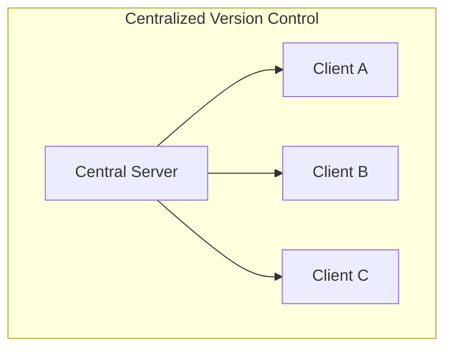

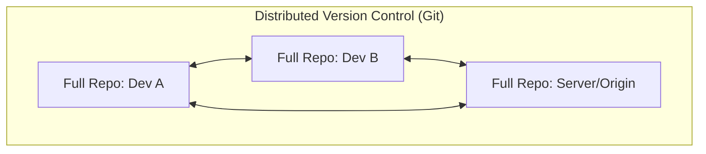

### 1.2 A Brief History of Git

| Year | Event |
|---|---|
| 1991–2005 | Linux kernel development used BitKeeper, a proprietary DVCS |
| 2005 | BitKeeper revoked its free license for the Linux community |
| **2005** | **Linus Torvalds** writes Git in about 10 days to replace it |
| 2005 | First kernel version managed by Git is released |
| 2008 | GitHub launches, popularizing Git for the masses |
| Today | Git is the de-facto global standard for version control |

> **📌 Note**
> "Git" is British slang for an unpleasant person. Linus Torvalds joked he names all his projects after himself — first Linux, then Git.

### 1.3 Why Git Specifically?

- **Speed** – almost all operations are local
- **Data integrity** – every object is checksummed with SHA-1/SHA-256
- **Distributed by design** – no single point of failure
- **Branching is cheap** – creating a branch is a 41-byte pointer, not a full copy
- **Massive ecosystem** – GitHub, GitLab, Bitbucket, Azure DevOps all build on it

### 1.4 Git Architecture — The Three Trees

Git operates on **three main areas** (plus the stash, a fourth optional area):

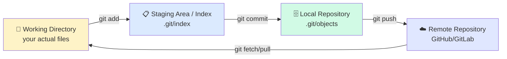

| Area | Location | Purpose |
|---|---|---|
| **Working Directory** | Your project folder | Files you edit directly |
| **Staging Area (Index)** | `.git/index` | A draft of your next commit |
| **Local Repository** | `.git/objects` | Permanent, committed history |
| **Remote Repository** | GitHub, GitLab, etc. | Shared copy for collaboration |

### 1.5 The Git Lifecycle of a File

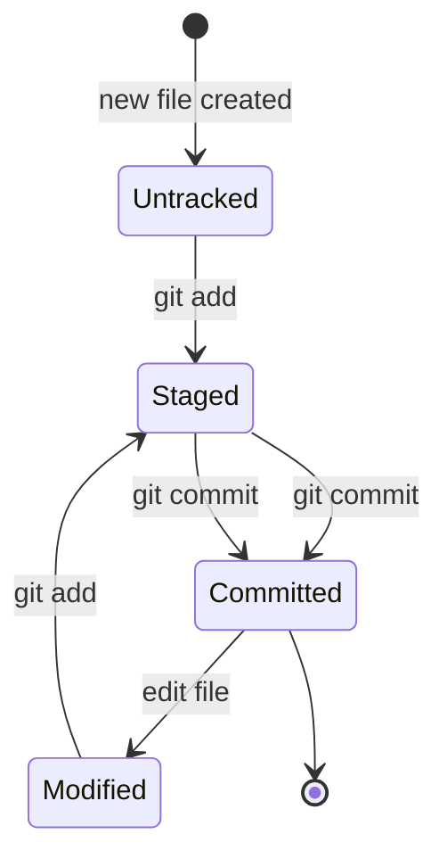

| State | Meaning |
|---|---|
| **Untracked** | Git doesn't know about this file yet |
| **Tracked – Unmodified** | Committed and unchanged since |
| **Tracked – Modified** | Changed since last commit, not staged |
| **Tracked – Staged** | Marked to go into the next commit |

### 1.6 Git Objects (The Database Model)

Git's entire history is a content-addressable key-value store of four object types:

| Object | Stores | Analogy |
|---|---|---|
| **Blob** | Raw file content (no filename) | A file's contents |
| **Tree** | A directory listing (filenames → blobs/trees) | A folder |
| **Commit** | A snapshot pointer + metadata (author, message, parent) | A save-point |
| **Tag** | A named, permanent pointer to a commit (annotated tags) | A bookmark |

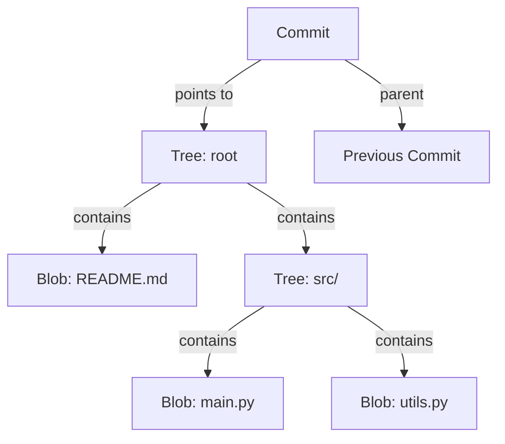

Every object is identified by a **SHA-1 hash** (a 40-character hexadecimal string, e.g. `a94a8fe5ccb19ba61c4c0873d391e987982fbbd`) computed from its content. Change one byte, and the hash — and every commit that references it — changes.

> **⚠️ Warning**
> Newer Git versions support **SHA-256** repositories as an experimental feature (`git init --object-format=sha256`), since SHA-1 has known theoretical collision weaknesses. Most repositories today still use SHA-1.

### 1.7 Key Terminology Reference

| Term | Definition |
|---|---|
| **Repository (repo)** | A `.git` folder containing the full history of a project |
| **HEAD** | A pointer to your current branch/commit ("where you are now") |
| **Branch** | A movable pointer to a commit; the "current line of work" |
| **Working Tree** | The actual files on disk you're editing |
| **Index / Staging Area** | The snapshot to be committed next |
| **Origin** | The default name for your primary remote |
| **Upstream** | The remote branch your local branch tracks |
| **Fork** | A personal server-side copy of someone else's repository (GitHub concept) |
| **Clone** | A full local copy of a remote repository |

<details>
<summary><strong>🌳 Local vs Remote Repository — Quick Comparison</strong></summary>

| | Local Repository | Remote Repository |
|---|---|---|
| Location | Your machine (`.git` folder) | A server (GitHub, GitLab, etc.) |
| Access | Instant, offline | Needs network |
| Purpose | Your personal history & experiments | Shared source of truth |
| Commands | `commit`, `branch`, `merge`, `rebase` | `push`, `pull`, `fetch`, `clone` |

</details>

[⬆️ Back to Top](#-the-complete-git--github-mastery-guide)

---

## ⚙️ 2. Installation

### 2.1 Windows

1. Download the installer from [git-scm.com](https://git-scm.com/download/win)
2. Run it — accept defaults unless you have a reason not to (recommended: choose **"Git from the command line and also from 3rd-party software"** and **VS Code** or **Vim** as default editor)
3. Verify:

```bash
git --version
# git version 2.45.1.windows.1
```

> **💡 Tip**
> Windows users doing serious development should strongly consider **WSL (Windows Subsystem for Linux)** for a native Linux Git experience — see [2.6](#26-wsl-windows-subsystem-for-linux).

### 2.2 macOS

| Method | Command |
|---|---|
| **Homebrew (recommended)** | `brew install git` |
| **Xcode Command Line Tools** | `xcode-select --install` |
| **Official installer** | Download from [git-scm.com](https://git-scm.com/download/mac) |

```bash
brew install git
git --version
```

### 2.3 Linux — Debian / Ubuntu

```bash
sudo apt update
sudo apt install git -y
git --version
```

### 2.4 Linux — Fedora

```bash
sudo dnf install git -y
```

### 2.5 Linux — Arch

```bash
sudo pacman -S git
```

### 2.5b Linux — Kali

```bash
sudo apt update && sudo apt install git -y
```

### 2.6 WSL (Windows Subsystem for Linux)

```bash
wsl --install                 # installs WSL + Ubuntu by default
sudo apt update && sudo apt install git -y
```

> **📌 Note**
> Git is often *pre-installed* on WSL Ubuntu images. Check with `git --version` before installing.

### 2.7 Installing From Source (Linux, any distro)

```bash
sudo apt install dh-autoreconf libcurl4-gnutls-dev libexpat1-dev \
  gettext libz-dev libssl-dev -y

wget https://github.com/git/git/archive/refs/tags/v2.45.1.tar.gz
tar -zxf v2.45.1.tar.gz
cd git-2.45.1
make prefix=/usr/local all
sudo make prefix=/usr/local install
```

### 2.8 Verifying Installation

```bash
git --version
git --help
which git        # macOS/Linux
where git         # Windows
```

### 2.9 Updating Git

| Platform | Command |
|---|---|
| macOS (Homebrew) | `brew upgrade git` |
| Ubuntu/Debian | `sudo apt update && sudo apt upgrade git` |
| Fedora | `sudo dnf upgrade git` |
| Windows | Re-run the installer or `git update-git-for-windows` |

### 2.10 Uninstalling Git

| Platform | Command |
|---|---|
| macOS (Homebrew) | `brew uninstall git` |
| Ubuntu/Debian | `sudo apt remove git` |
| Fedora | `sudo dnf remove git` |
| Windows | Uninstall via *Add or Remove Programs* |

### 2.11 Troubleshooting Installation

<details>
<summary><strong>❌ "git: command not found"</strong></summary>

Git isn't installed, or isn't on your `PATH`. Reinstall, or manually add the Git `bin` folder to your system `PATH` environment variable.
</details>

<details>
<summary><strong>❌ "xcrun: error: invalid active developer path" (macOS)</strong></summary>

Run `xcode-select --install` to reinstall the Command Line Tools.
</details>

<details>
<summary><strong>❌ Permission denied errors on Linux install</strong></summary>

Prefix your package manager command with `sudo`.
</details>

[⬆️ Back to Top](#-the-complete-git--github-mastery-guide)

---

## 🔧 3. Configuration

Git configuration lives in three scopes, applied in increasing priority:

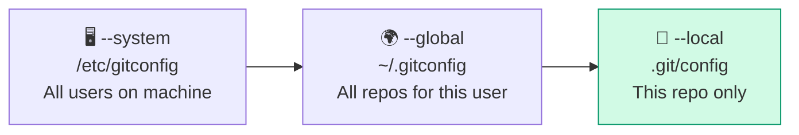

| Scope | Flag | File | Priority |
|---|---|---|---|
| System | `--system` | `/etc/gitconfig` | Lowest |
| Global | `--global` | `~/.gitconfig` | Medium |
| Local | `--local` (default) | `.git/config` | **Highest** |

### 3.1 Identity Setup (Required First Step)

```bash
git config --global user.name "Atia Rahman"
git config --global user.email "atia@example.com"
```

> **⚠️ Warning**
> Every commit you make is permanently stamped with this name/email. Set it correctly *before* your first commit — changing it later doesn't retroactively fix old commits.

### 3.2 Default Branch Name

```bash
git config --global init.defaultBranch main
```

### 3.3 Default Editor

```bash
git config --global core.editor "code --wait"    # VS Code
git config --global core.editor "vim"             # Vim
git config --global core.editor "nano"            # Nano
```

### 3.4 Merge & Diff Tools

```bash
git config --global merge.tool vscode
git config --global mergetool.vscode.cmd 'code --wait $MERGED'

git config --global diff.tool vscode
git config --global difftool.vscode.cmd 'code --wait --diff $LOCAL $REMOTE'
```

### 3.5 Color Output

```bash
git config --global color.ui auto
```

### 3.6 Credential Manager (avoid retyping passwords)

```bash
# Windows / cross-platform (Git Credential Manager)
git config --global credential.helper manager

# macOS
git config --global credential.helper osxkeychain

# Linux (cache for 15 minutes)
git config --global credential.helper cache
git config --global credential.helper 'cache --timeout=900'
```

### 3.7 Aliases — Speed Up Your Workflow

```bash
git config --global alias.co checkout
git config --global alias.br branch
git config --global alias.ci commit
git config --global alias.st status
git config --global alias.last "log -1 HEAD"
git config --global alias.unstage "reset HEAD --"
git config --global alias.lg "log --oneline --graph --all --decorate"
```

| Alias | Expands to | Use |
|---|---|---|
| `git co` | `git checkout` | Faster branch switching |
| `git st` | `git status` | Fastest, most-used command |
| `git lg` | pretty graph log | Visual history at a glance |

### 3.8 Listing, Editing & Removing Config

```bash
git config --list                     # all effective config
git config --list --show-origin       # + which file each came from
git config user.name                  # read a single value
git config --global --edit            # open ~/.gitconfig in editor
git config --global --unset user.name # remove a key
git config --global --remove-section alias  # remove whole section
```

<details>
<summary><strong>📋 Sample ~/.gitconfig file</strong></summary>

```ini
[user]
    name = Atia Rahman
    email = atia@example.com
[init]
    defaultBranch = main
[core]
    editor = code --wait
[color]
    ui = auto
[alias]
    co = checkout
    st = status
    lg = log --oneline --graph --all --decorate
[credential]
    helper = manager
```

</details>

> **✅ Best Practice**
> Keep secrets (tokens, passwords) **out** of `.gitconfig` — use a credential manager or environment variables instead.

[⬆️ Back to Top](#-the-complete-git--github-mastery-guide)

---

## 📁 4. Creating Repositories

### 4.1 `git init` — Start a New Repository

**Purpose:** Turns any folder into a Git repository by creating a hidden `.git` subfolder containing the object database.

```bash
git init                      # initialize in current directory
git init my-project           # initialize in a new folder
git init --bare                # create a bare repo (no working directory)
```

**Terminal output:**
```
Initialized empty Git repository in /home/user/my-project/.git/
```

> **💡 Tip:** A **bare repository** (`--bare`) has no working directory — it only stores history. Bare repos are used as *central servers* that developers push to and pull from, never edited directly.

### 4.2 `git clone` — Copy an Existing Repository

```bash
git clone https://github.com/user/repo.git
git clone git@github.com:user/repo.git              # via SSH
git clone https://github.com/user/repo.git myfolder  # custom folder name
```

#### Clone a Specific Branch

```bash
git clone -b develop --single-branch https://github.com/user/repo.git
```

#### Shallow Clone (limit history depth — faster, smaller)

```bash
git clone --depth 1 https://github.com/user/repo.git
```

> **📌 Note:** Shallow clones are excellent for CI pipelines that just need to build the latest code and don't need history.

#### Mirror Clone (exact 1:1 copy, all refs, for migration)

```bash
git clone --mirror https://github.com/user/repo.git
```

#### Bare Repository (server-side use)

```bash
git clone --bare https://github.com/user/repo.git repo.git
```

#### Clone From a Template Repository (GitHub)

On GitHub, click **"Use this template"** on a repo marked as a template, or:

```bash
gh repo create my-new-project --template user/template-repo
```

<details>
<summary><strong>🔧 Common Mistakes</strong></summary>

- Running `git init` *inside* an already-cloned repo (nested `.git` folders) — check with `git status` first.
- Forgetting `--depth 1` on CI, causing slow, full-history clones on every build.
- Cloning with HTTPS when you meant to use SSH (or vice versa) — leads to authentication confusion later.

</details>

**Related commands:** [`git remote`](#91-git-remote), [`git fetch`](#92-git-fetch), [`git pull`](#93-git-pull)

[⬆️ Back to Top](#-the-complete-git--github-mastery-guide)

---

## 🔁 5. Basic Workflow

This is the command set you will use **every single day**.

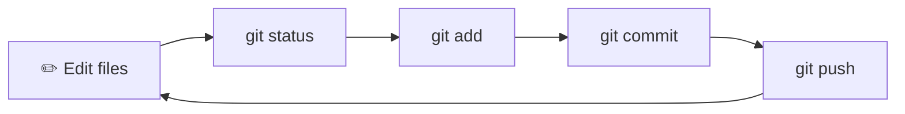

### 5.1 `git status` — Check the State of Your Repo

```bash
git status
git status -s        # short format
```

**Sample output:**
```
On branch main
Changes not staged for commit:
  (use "git add <file>..." to update what will be committed)
        modified:   index.html

Untracked files:
  (use "git add <file>..." to include in what will be committed)
        style.css
```

Short format symbols:

| Symbol | Meaning |
|---|---|
| `??` | Untracked file |
| `M ` | Modified, staged |
| ` M` | Modified, unstaged |
| `A ` | Added (new file staged) |
| `D ` | Deleted |
| `R ` | Renamed |
| `UU` | Unmerged (conflict) |

### 5.2 `git add` — Stage Changes

```bash
git add file.txt          # stage one file
git add file1.txt file2.txt
git add .                  # stage everything in current dir & below
git add -A                 # stage everything in the whole repo
git add -p                 # interactively stage hunks (patch mode)
git add *.js                # stage by pattern
```

> **✅ Best Practice:** Use `git add -p` to review each change block-by-block before staging — it prevents accidentally committing debug code or secrets.

### 5.3 `git commit` — Save a Snapshot

```bash
git commit -m "Add login form validation"
git commit -am "Fix typo"          # add + commit tracked files in one step
git commit --amend                  # edit the last commit
git commit --amend --no-edit        # add staged changes to last commit, keep message
git commit -m "Title" -m "Longer description body"
```

> **⚠️ Warning:** Never `--amend` a commit that has already been **pushed and pulled by others** — it rewrites history and will cause conflicts for your teammates.

### 5.4 `git log` — View History

```bash
git log
git log --oneline
git log --oneline --graph --all --decorate
git log -p                  # show full diffs
git log -3                   # last 3 commits
git log --author="Atia"
git log --since="2 weeks ago"
git log -- file.txt          # history of one file
```

### 5.5 `git diff` — Compare Changes

```bash
git diff                       # working dir vs staging
git diff --staged              # staging vs last commit
git diff HEAD                   # working dir vs last commit
git diff branch1 branch2        # compare two branches
git diff commit1 commit2 -- file.txt
```

### 5.6 `git restore` — Undo Working Directory / Staging Changes (modern)

```bash
git restore file.txt              # discard unstaged changes
git restore --staged file.txt     # unstage (keep changes in working dir)
git restore --source=HEAD~1 file.txt   # restore file from an older commit
```

### 5.7 `git rm` / `git mv`

```bash
git rm file.txt                  # delete file + stage the deletion
git rm --cached file.txt         # untrack file but keep it on disk
git mv old_name.txt new_name.txt  # rename + stage in one step
```

### 5.8 `git show`

```bash
git show HEAD                  # full details of latest commit
git show a1b2c3d                # details of a specific commit
git show HEAD:file.txt          # file contents as of a commit
```

### 5.9 `git reset` — Move HEAD / Unstage / Discard

| Mode | Effect on Working Dir | Effect on Staging | Effect on History |
|---|:---:|:---:|:---:|
| `--soft` | Unchanged | Unchanged (still staged) | Moves HEAD |
| `--mixed` *(default)* | Unchanged | Cleared (unstaged) | Moves HEAD |
| `--hard` | **Discarded** ⚠️ | Cleared | Moves HEAD |

```bash
git reset --soft HEAD~1     # undo last commit, keep changes staged
git reset HEAD~1            # undo last commit, keep changes unstaged
git reset --hard HEAD~1     # ⚠️ undo last commit AND discard all changes
git reset file.txt          # unstage a specific file
```

> **⚠️ Warning:** `git reset --hard` **permanently discards uncommitted work.** Always run `git status` and `git stash` first if unsure.

### 5.10 `git clean` — Remove Untracked Files

```bash
git clean -n         # dry run — preview what would be deleted
git clean -f          # force-delete untracked files
git clean -fd         # also delete untracked directories
git clean -fx         # also delete ignored files
```

### 5.11 Git Stash — Save Work-in-Progress Without Committing

```bash
git stash                       # stash tracked changes
git stash -u                     # also stash untracked files
git stash save "WIP: navbar"     # stash with a message
git stash list                   # see all stashes
git stash show -p stash@{0}      # view diff of a stash
git stash pop                    # apply + delete the latest stash
git stash apply stash@{1}        # apply without deleting
git stash drop stash@{0}         # delete one stash
git stash clear                  # delete ALL stashes
git stash branch new-branch      # create a branch from a stash
```

> **💡 Tip:** Think of the stash as a clipboard for your working directory — perfect when you need to `git pull` or switch branches urgently but aren't ready to commit.

**Related commands:** [`git branch`](#-6-branching), [`git checkout`](#-11-undo-operations)

[⬆️ Back to Top](#-the-complete-git--github-mastery-guide)

---

## 🌿 6. Branching

### 6.1 Why Branches Exist

A branch is nothing more than a **41-byte pointer** to a commit. This makes branching in Git nearly instantaneous and cheap — unlike older systems where branching meant copying the entire codebase.

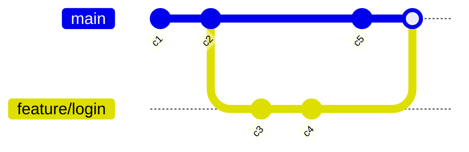

> **💡 Why it exists:** Branches let multiple people (or multiple features) develop in parallel without interfering with the stable `main` line.

### 6.2 Core Branch Commands

```bash
git branch                        # list local branches
git branch -a                      # list all (local + remote)
git branch -r                      # list remote-tracking branches
git branch new-feature              # create a branch (doesn't switch to it)
git checkout new-feature             # switch to it
git checkout -b new-feature          # create AND switch, in one step
git switch new-feature                # modern equivalent of checkout (switch only)
git switch -c new-feature             # modern equivalent of checkout -b
git branch -d old-feature             # delete a merged branch (safe)
git branch -D old-feature             # force-delete (even if unmerged) ⚠️
git branch -m old-name new-name       # rename current or specified branch
git branch -v                          # list branches with last commit info
git branch --merged                    # branches already merged into current
git branch --no-merged                 # branches NOT yet merged
```

### 6.3 `git switch` vs `git checkout`

| | `git checkout` | `git switch` (Git 2.23+) |
|---|---|---|
| Purpose | Switch branches **or** restore files (overloaded) | Switch branches **only** |
| Clarity | Ambiguous — can accidentally discard file changes | Explicit and safer |
| Create + switch | `git checkout -b name` | `git switch -c name` |

> **✅ Best Practice:** Prefer `git switch` and `git restore` in modern workflows — they split `checkout`'s two responsibilities into clearer, safer commands.

### 6.4 Real-World Example

```bash
git switch -c feature/user-auth
# ... make changes ...
git add .
git commit -m "feat: add JWT-based authentication"
git push -u origin feature/user-auth
# open a Pull Request on GitHub
```

### 6.5 Branch Naming Conventions

| Type | Pattern | Example |
|---|---|---|
| Feature | `feature/<name>` | `feature/checkout-flow` |
| Bugfix | `fix/<name>` or `bugfix/<name>` | `fix/null-pointer-cart` |
| Hotfix | `hotfix/<name>` | `hotfix/payment-crash` |
| Release | `release/<version>` | `release/2.4.0` |
| Chore | `chore/<name>` | `chore/upgrade-deps` |

<details>
<summary><strong>🔧 Common Mistakes</strong></summary>

- Working directly on `main`/`master` — always branch first.
- Deleting a branch with unmerged work using `-D` without checking `--no-merged` first.
- Forgetting `-u`/`--set-upstream` on first push, then confusion about why `git pull` fails.

</details>

**Related commands:** [`git merge`](#-7-merging), [`git rebase`](#-8-rebasing), [`git push`](#94-git-push)

[⬆️ Back to Top](#-the-complete-git--github-mastery-guide)

---

## 🔀 7. Merging

### 7.1 `git merge` Basics

```bash
git switch main
git merge feature/login
```

### 7.2 Merge Strategies

| Strategy | Command | When Used | Result |
|---|---|---|---|
| **Fast-Forward** | `git merge feature` (default when possible) | No divergent commits on `main` | Pointer just moves forward, no merge commit |
| **No Fast-Forward** | `git merge --no-ff feature` | Want an explicit merge commit for history/audit | Always creates a merge commit |
| **Squash** | `git merge --squash feature` | Want one clean commit from many messy ones | Combines all changes into a single new commit (you must still `git commit`) |
| **Octopus** | `git merge b1 b2 b3` | Merging 3+ branches at once (rare) | One commit with multiple parents |
| **Recursive** *(legacy default before Git 2.33)* | automatic | Two branches with a single common ancestor | Standard 3-way merge |
| **ORT** *(default since Git 2.33)* | automatic | Same use case, faster & more accurate | Successor to recursive strategy |

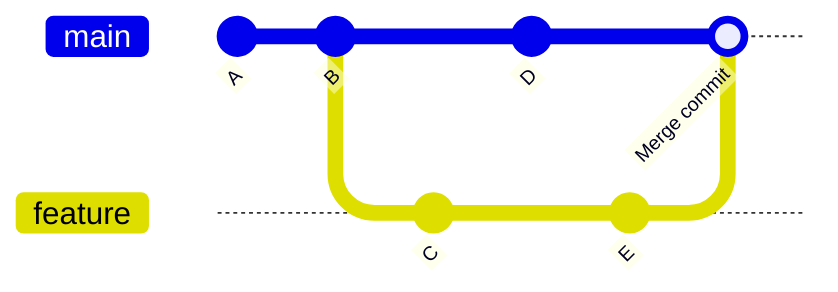

### 7.3 Fast-Forward vs No-Fast-Forward — Visual

```
Fast-Forward:                     No-Fast-Forward (--no-ff):

main:    A---B                     main:    A---B-------M
                \                                \      /
feature:         C---D              feature:      C----D
(main just moves to D)             (explicit merge commit M created)
```

### 7.4 Resolving Merge Conflicts

When two branches edit the same lines, Git can't auto-merge and marks the file:

```
<<<<<<< HEAD
const greeting = "Hello, World!";
=======
const greeting = "Hi there, World!";
>>>>>>> feature/greeting
```

**Resolution steps:**

```bash
git status                     # see which files are in conflict
# manually edit the file, remove <<<<<<<, =======, >>>>>>> markers
git add resolved-file.txt
git commit                      # completes the merge
```

To abort a messy merge entirely:

```bash
git merge --abort
```

### 7.5 Merge Tools

```bash
git mergetool                  # opens configured GUI merge tool
git config --global merge.tool vscode
```

Popular merge tools: VS Code, Meld, KDiff3, Beyond Compare, `vimdiff`, GitHub Desktop.

> **✅ Best Practice:** Use `--no-ff` when merging feature branches into `main`/`develop` so the history clearly shows *when* a feature was integrated — this is invaluable for release notes and audits.

<details>
<summary><strong>🔧 Common Mistakes</strong></summary>

- Panicking during a conflict and running `git reset --hard` (losing work) instead of `git merge --abort`.
- Committing conflict markers by accident (forgetting to remove `<<<<<<<`).
- Merging `main` into a stale feature branch instead of rebasing, cluttering history unnecessarily.

</details>

**Related commands:** [`git rebase`](#-8-rebasing), [`git diff`](#55-git-diff), [`git log --merges`](#-13-git-history--log-formatting)

[⬆️ Back to Top](#-the-complete-git--github-mastery-guide)

---

## 🧬 8. Rebasing

### 8.1 What Rebase Does

`git rebase` replays your commits **on top of** another branch, creating a linear history instead of a merge commit.

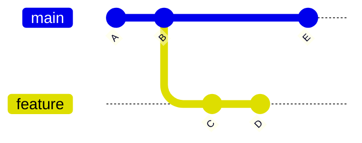

```
Before rebase:                  After `git rebase main` (on feature):

main:     A---B---E             main:     A---B---E
               \                                    \
feature:        C---D           feature:              C'---D'
```

```bash
git switch feature
git rebase main
```

> **⚠️ Warning — The Golden Rule of Rebasing**
> **Never rebase commits that have already been pushed to a shared branch** and pulled by others. Rebase rewrites commit hashes; anyone who already has the old commits will face painful, confusing conflicts. Only rebase **local/private** branches, or ones you're 100% sure nobody else is using.

### 8.2 Interactive Rebase — The Swiss Army Knife

```bash
git rebase -i HEAD~5      # interactively edit the last 5 commits
```

Opens an editor:

```
pick a1b2c3d Add login form
pick e4f5g6h Fix typo
pick h7i8j9k Add validation
pick k1l2m3n WIP debug print
pick n4o5p6q Add tests

# Commands:
# p, pick   = use commit as-is
# r, reword = use commit, edit message
# e, edit   = use commit, stop for amending
# s, squash = combine with previous commit, keep both messages
# f, fixup  = combine with previous commit, discard this message
# d, drop   = remove commit entirely
```

| Command | Effect |
|---|---|
| `pick` | Keep commit unchanged |
| `reword` | Keep changes, edit the commit message |
| `edit` | Pause here to amend the commit (add files, split it, etc.) |
| `squash` | Merge into previous commit, combine messages |
| `fixup` | Merge into previous commit, **discard** this message |
| `drop` | Delete the commit entirely |

### 8.3 Common Interactive Rebase Recipes

**Squash last 3 commits into 1:**
```bash
git rebase -i HEAD~3
# mark the bottom two as "squash" or "fixup"
```

**Reword the last commit message:**
```bash
git commit --amend -m "New message"
# or, further back:
git rebase -i HEAD~3   # mark target commit as "reword"
```

**Split a commit in two:**
```bash
git rebase -i HEAD~3    # mark as "edit"
git reset HEAD^          # un-commit but keep changes
git add file1.txt
git commit -m "First half"
git add file2.txt
git commit -m "Second half"
git rebase --continue
```

**Recover from a rebase mistake:**
```bash
git rebase --abort         # bail out completely, restore original state
git reflog                  # find the commit hash before the rebase started
git reset --hard HEAD@{5}   # restore to that point
```

### 8.4 `git cherry-pick` — Apply a Specific Commit Elsewhere

```bash
git cherry-pick a1b2c3d              # apply one commit onto current branch
git cherry-pick a1b2c3d b2c3d4e       # apply multiple commits
git cherry-pick a1b2c3d..h7i8j9k      # apply a range (exclusive of first)
git cherry-pick --no-commit a1b2c3d   # apply changes without committing
git cherry-pick --continue             # after resolving a conflict
git cherry-pick --abort                # cancel
```

> **💡 When to use:** You need one specific bugfix from another branch without merging its entire history — very common for backporting a hotfix to a `release` branch.

### 8.5 `rebase` vs `merge` — Which to Use?

| | `merge` | `rebase` |
|---|---|---|
| History | Preserves exact history, non-linear | Linear, "clean" history |
| Safety on shared branches | ✅ Safe | ⚠️ Dangerous (rewrites hashes) |
| Merge commit | Creates one (unless FF) | None — commits are replayed |
| Best for | Integrating finished features into `main` | Cleaning up your **local** branch before opening a PR |

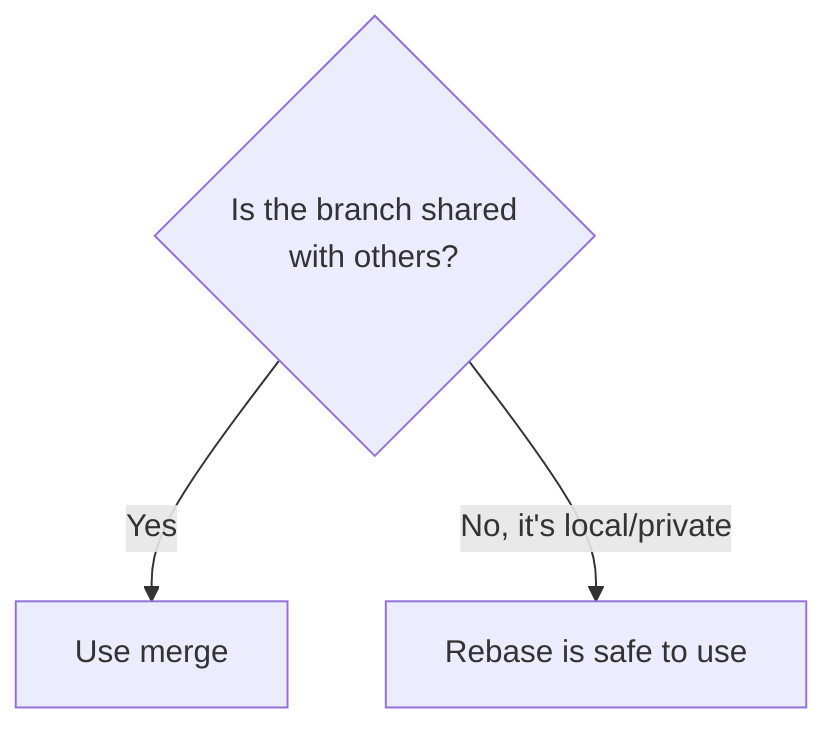

<details>
<summary><strong>🔧 Common Mistakes</strong></summary>

- Rebasing a branch that others have already pulled → force-push chaos.
- Forgetting `git rebase --continue` after resolving each conflicting commit during an interactive rebase.
- Using `git push` after a rebase instead of `git push --force-with-lease` (see [Section 25](#-25-advanced-git)).

</details>

**Related commands:** [`git merge`](#-7-merging), [`git reflog`](#114-git-reflog), [`git reset`](#59-git-reset--move-head--unstage--discard)

[⬆️ Back to Top](#-the-complete-git--github-mastery-guide)

---

## ☁️ 9. Remote Repositories

### 9.1 `git remote`

```bash
git remote -v                              # list remotes with URLs
git remote add origin https://github.com/user/repo.git
git remote rename origin upstream
git remote remove origin
git remote set-url origin git@github.com:user/repo.git
git remote show origin                      # detailed info
```

### 9.2 `git fetch` — Download Without Merging

```bash
git fetch origin                # fetch all branches from origin
git fetch origin main            # fetch just one branch
git fetch --all                   # fetch from every remote
git fetch --prune                 # also remove stale remote-tracking refs
```

> **💡 Tip:** `fetch` is always safe — it updates your knowledge of the remote (`origin/main`) without touching your working directory or local branches. `pull` is `fetch` + `merge` (or `rebase`).

### 9.3 `git pull`

```bash
git pull origin main
git pull --rebase origin main    # rebase instead of merge (linear history)
git pull --ff-only                # fail instead of creating a merge commit
```

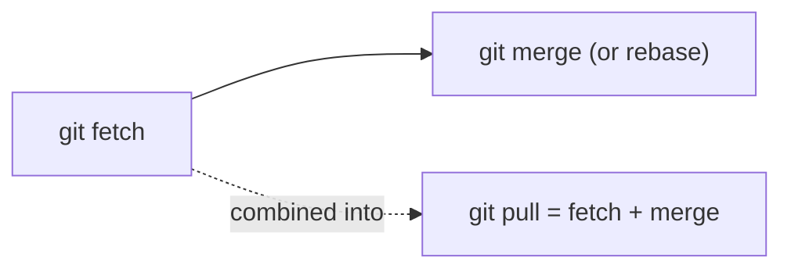

### 9.4 `git push`

```bash
git push origin main
git push -u origin feature/x       # set upstream tracking on first push
git push                            # after upstream is set
git push --all                       # push all branches
git push --tags                      # push all tags
git push origin --delete feature/x   # delete a remote branch
```

### 9.5 Origin, Upstream & Fork Terminology

| Term | Meaning |
|---|---|
| **origin** | Default alias for the remote you cloned from |
| **upstream** | Convention for the *original* repo when you're working from a **fork** |
| **tracking branch** | A local branch linked to a remote branch (e.g. `main` → `origin/main`) |

```bash
# Standard open-source fork setup
git clone git@github.com:your-username/repo.git
cd repo
git remote add upstream git@github.com:original-owner/repo.git
git fetch upstream
git merge upstream/main       # keep your fork in sync
```

### 9.6 Tracking Branches

```bash
git branch -vv                          # show tracking info for all branches
git branch --set-upstream-to=origin/main main
git push -u origin main                  # sets tracking automatically
```

### 9.7 Pruning Stale Remote Branches

```bash
git fetch --prune
git remote prune origin
```

### 9.8 Mirror

```bash
git push --mirror git@newhost:user/repo.git    # push absolutely everything, exact copy
```

<details>
<summary><strong>🔧 Common Mistakes</strong></summary>

- Pushing to the wrong remote (`origin` vs `upstream`) when working with forks.
- Forgetting `-u` on first push, leading to `git pull` errors like "no tracking information."
- Not pruning stale branches, cluttering `git branch -a` output over time.

</details>

**Related commands:** [`git clone`](#42-git-clone--copy-an-existing-repository), [`git branch`](#-6-branching)

[⬆️ Back to Top](#-the-complete-git--github-mastery-guide)

---

## 🏷️ 10. Tags

Tags are **permanent named pointers** to specific commits — typically used to mark release points (`v1.0.0`, `v2.3.1`).

### 10.1 Lightweight Tags

```bash
git tag v1.0.0                     # tag the current commit
git tag v0.9.0 a1b2c3d               # tag a specific past commit
```

### 10.2 Annotated Tags (recommended)

```bash
git tag -a v1.0.0 -m "Release version 1.0.0"
```

> **✅ Best Practice:** Always use **annotated** tags (`-a`) for releases — they store tagger name, email, date, and message as a full Git object, unlike lightweight tags which are just a pointer.

### 10.3 Signed Tags (GPG)

```bash
git tag -s v1.0.0 -m "Signed release 1.0.0"
git tag -v v1.0.0                   # verify a signature
```

### 10.4 Listing & Viewing Tags

```bash
git tag                             # list all tags
git tag -l "v1.*"                    # filter by pattern
git show v1.0.0                      # show tag details + commit
```

### 10.5 Pushing Tags

```bash
git push origin v1.0.0                # push one tag
git push origin --tags                 # push all tags
git push --follow-tags                  # push commits + annotated tags together
```

### 10.6 Deleting Tags

```bash
git tag -d v1.0.0                        # delete locally
git push origin --delete v1.0.0          # delete on remote
```

### 10.7 Checking Out a Tag

```bash
git checkout v1.0.0            # detached HEAD state — read-only inspection
git switch -c hotfix-from-tag v1.0.0   # create a branch FROM a tag (recommended)
```

> **⚠️ Warning:** Checking out a tag directly puts you in **detached HEAD** state. Any commits you make there can be lost unless you create a branch first.

[⬆️ Back to Top](#-the-complete-git--github-mastery-guide)

---

## ↩️ 11. Undo Operations

> **📌 Note:** This is the single most important section for beginners. Almost every Git "disaster" is recoverable — Git rarely truly deletes data immediately.

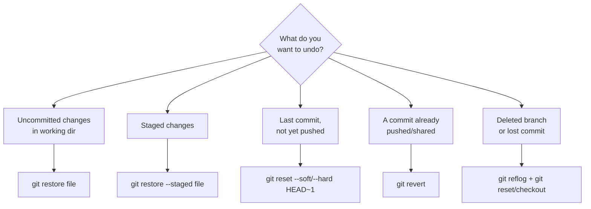

### 11.1 `git restore` (modern, safe)

```bash
git restore file.txt                 # discard working-dir changes
git restore --staged file.txt        # unstage
git restore --staged --worktree .    # unstage everything AND discard changes
```

### 11.2 `git reset` (moves branch pointer)

*(Full detail in [5.9](#59-git-reset--move-head--unstage--discard))*

```bash
git reset --soft HEAD~1
git reset --hard HEAD~1     # ⚠️ destructive
```

### 11.3 `git revert` — Undo Safely on Shared History

Unlike `reset`, `revert` doesn't rewrite history — it creates a **new commit** that undoes a previous one. This is safe on shared/pushed branches.

```bash
git revert a1b2c3d                 # revert one commit
git revert HEAD                     # revert the most recent commit
git revert --no-commit a1b2c3d h7i8j9k   # revert multiple without auto-committing
git revert -m 1 a1b2c3d              # revert a merge commit (specify parent)
```

> **✅ Best Practice:** On any branch other people have pulled (like `main`), always use `revert`, never `reset --hard` + force-push.

### 11.4 `git checkout` (legacy undo usage)

```bash
git checkout -- file.txt          # legacy way to discard changes (use restore instead)
git checkout a1b2c3d -- file.txt   # restore a file from an old commit
```

### 11.5 `git reflog` — Your Safety Net

Every movement of `HEAD` (commits, resets, checkouts, rebases, merges) is logged locally — even after you think something is "lost."

```bash
git reflog
```

**Sample output:**
```
a1b2c3d HEAD@{0}: commit: Add payment integration
h7i8j9k HEAD@{1}: reset: moving to HEAD~1
k1l2m3n HEAD@{2}: commit: Fix bug in checkout
```

**Recover a "lost" commit:**

```bash
git reflog                       # find the hash, e.g. h7i8j9k
git checkout h7i8j9k               # inspect it (detached HEAD)
git switch -c recovered-branch     # save it permanently
# OR
git reset --hard h7i8j9k           # if you want your current branch to go back there
```

> **💡 Tip:** `reflog` entries expire after 90 days by default (30 for unreachable ones) — but that's still a huge safety window.

### 11.6 `git fsck` — Find Dangling / Lost Objects

```bash
git fsck --lost-found
git fsck --unreachable
```

Useful as a last resort when `reflog` itself doesn't have what you need (e.g., after `git gc`).

### 11.7 Recovering a Deleted Branch

```bash
git reflog                                  # find the last commit of the deleted branch
git branch recovered-branch a1b2c3d
```

### 11.8 Undo Cheat Table

| Situation | Command |
|---|---|
| Discard unstaged file changes | `git restore file.txt` |
| Unstage a file | `git restore --staged file.txt` |
| Undo last commit, keep changes staged | `git reset --soft HEAD~1` |
| Undo last commit, discard changes | `git reset --hard HEAD~1` ⚠️ |
| Undo a **pushed** commit safely | `git revert <hash>` |
| Recover deleted branch/commit | `git reflog` + `git branch` |
| Remove untracked files | `git clean -fd` |
| Fix wrong last commit message | `git commit --amend` |

[⬆️ Back to Top](#-the-complete-git--github-mastery-guide)

---

## 🔍 12. Searching Git History

### 12.1 `git grep` — Search File Contents

```bash
git grep "TODO"                       # search working directory
git grep -n "function login"           # show line numbers
git grep -c "import React"              # count matches per file
git grep "bug" $(git rev-list --all)     # search across ALL commits
```

### 12.2 Filtering `git log`

```bash
git log --author="Atia"
git log --since="2024-01-01" --until="2024-06-01"
git log --grep="fix"                     # search commit messages
git log --all --grep="login" -i           # case-insensitive
git log -- path/to/file.js                # commits touching this file
```

### 12.3 The Pickaxe (`-S` / `-G`) — Search for Code Changes

```bash
git log -S "calculateTotal"       # commits that added/removed this exact string
git log -G "regex.*pattern"        # commits matching a regex change
```

> **💡 When to use:** "When did this function get removed?" or "Which commit introduced this bug-causing line?" — pickaxe searches the actual *diff content*, not just messages.

### 12.4 `git blame` — Who Changed This Line & When

```bash
git blame file.txt
git blame -L 10,20 file.txt        # only lines 10-20
git blame -w file.txt               # ignore whitespace changes
git blame -C file.txt                # detect moved/copied lines
```

**Sample output:**
```
a1b2c3d4 (Atia Rahman  2024-03-15 10:22:03 +0600  12) function login(user) {
h7i8j9k1 (John Smith   2024-04-02 14:05:11 +0600  13)   validateInput(user);
```

### 12.5 `git bisect` — Binary Search for the Bug

```bash
git bisect start
git bisect bad                     # current commit is broken
git bisect good v1.0.0              # this old tag was known-good
# Git checks out a middle commit — you test it, then:
git bisect good     # or
git bisect bad
# ... repeat until Git identifies the exact culprit commit
git bisect reset                    # return to original HEAD when done
```

**Automated version (if you have a test script):**

```bash
git bisect start HEAD v1.0.0
git bisect run npm test
```

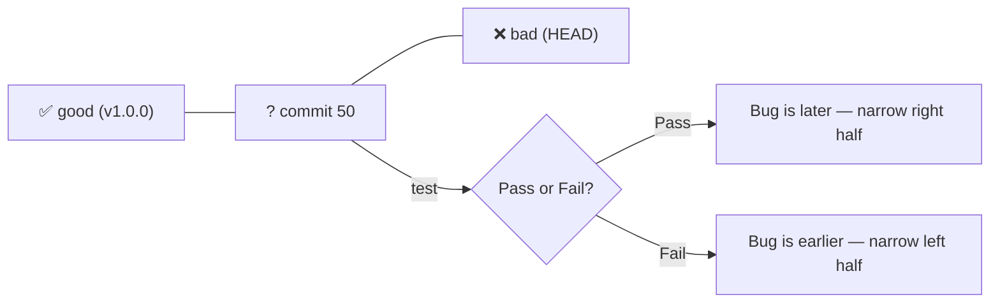

<details>
<summary><strong>🔧 Common Mistakes</strong></summary>

- Forgetting `git bisect reset` after finishing, leaving the repo in a detached-HEAD state.
- Using `grep` on the working directory when the string you need only exists in old history (use `git log -S` instead).

</details>

**Related commands:** [`git log`](#54-git-log--view-history), [`git show`](#58-git-show)

[⬆️ Back to Top](#-the-complete-git--github-mastery-guide)

---

## 📜 13. Git History & Log Formatting

### 13.1 Graph View

```bash
git log --oneline --graph --all --decorate
```

**Sample output:**
```
* a1b2c3d (HEAD -> main, origin/main) Merge feature/login
|\
| * h7i8j9k (feature/login) Add login validation
| * k1l2m3n Add login form
|/
* m3n4o5p Initial commit
```

### 13.2 Pretty Formats

```bash
git log --pretty=format:"%h - %an, %ar : %s"
git log --pretty=full
git log --pretty=fuller
```

| Placeholder | Meaning |
|---|---|
| `%h` | Abbreviated commit hash |
| `%H` | Full commit hash |
| `%an` | Author name |
| `%ae` | Author email |
| `%ar` | Author date, relative (e.g. "3 days ago") |
| `%s` | Subject (commit message first line) |
| `%d` | Ref names (branches/tags) |

### 13.3 `git shortlog` — Contributor Summary

```bash
git shortlog -sn                 # summary, sorted by commit count
git shortlog -sne                # + email
```

**Sample output:**
```
    42  Atia Rahman
    17  John Smith
     5  Jane Doe
```

### 13.4 `git notes` — Attach Extra Metadata to Commits

```bash
git notes add -m "Reviewed and approved by QA" a1b2c3d
git notes show a1b2c3d
git log --show-notes
```

### 13.5 Filtering Merge Commits

```bash
git log --merges          # only merge commits
git log --no-merges        # exclude merge commits (cleaner feature history)
```

[⬆️ Back to Top](#-the-complete-git--github-mastery-guide)

---

## 🧠 14. Git Internals

### 14.1 The `.git` Directory Structure

```
.git/
├── HEAD                 # pointer to current branch (ref)
├── config                # repo-local configuration
├── description           # used by gitweb (rarely used)
├── hooks/                 # client-side scripts (see Section 15)
├── index                  # the staging area
├── objects/                # the object database (blobs, trees, commits, tags)
│   ├── a9/
│   │   └── 4a8fe5ccb19ba61c4c0873d391e987982fbbd
│   └── pack/                # compressed packfiles
├── refs/
│   ├── heads/                # local branches
│   ├── remotes/               # remote-tracking branches
│   └── tags/                   # tags
└── logs/                       # reflog data
```

### 14.2 Plumbing vs Porcelain

Git commands are split into two layers:

| Layer | Purpose | Examples |
|---|---|---|
| **Porcelain** | High-level, user-friendly commands | `git commit`, `git merge`, `git status` |
| **Plumbing** | Low-level building blocks | `git hash-object`, `git cat-file`, `git update-ref` |

### 14.3 Exploring Objects Manually

```bash
echo "Hello Git" | git hash-object --stdin
# → prints the SHA-1 that content would have

git cat-file -p a94a8fe5ccb19ba61c4c0873d391e987982fbbd    # print object content
git cat-file -t a94a8fe5ccb19ba61c4c0873d391e987982fbbd    # print object type
git cat-file -p HEAD                                        # print current commit
git cat-file -p HEAD^{tree}                                  # print current tree
```

### 14.4 `git rev-parse` — Resolve References

```bash
git rev-parse HEAD                 # full SHA of current commit
git rev-parse --short HEAD          # abbreviated
git rev-parse main                   # SHA a branch points to
git rev-parse --show-toplevel        # absolute path to repo root
```

### 14.5 Commit Ancestry Notation

| Notation | Meaning |
|---|---|
| `HEAD~1` | 1 commit before HEAD |
| `HEAD~3` | 3 commits before HEAD |
| `HEAD^` | First parent of HEAD |
| `HEAD^2` | Second parent (for merge commits) |
| `HEAD^^` | Same as `HEAD~2` |
| `main..feature` | Commits in `feature` not in `main` |
| `main...feature` | Commits in either, not in both (symmetric diff) |

### 14.6 Packfiles & Compression

Git periodically compresses loose objects into **packfiles** for efficiency (see [Section 23](#-23-git-maintenance)):

```bash
git gc                      # trigger garbage collection + packing
git verify-pack -v .git/objects/pack/pack-*.idx
```

### 14.7 SHA Hashing Explained

```bash
echo -n "hello" | git hash-object --stdin
# aaf4c61ddcc5e8a2dabede0f3b482cd9aea9434d
```

Git computes: `SHA1("blob " + content_length + "\0" + content)`. This is why identical content anywhere in history — even in different files — is stored **once** (deduplication).

[⬆️ Back to Top](#-the-complete-git--github-mastery-guide)

---

## 🪝 15. Git Hooks

Hooks are scripts Git runs automatically at specific points in the workflow. They live in `.git/hooks/` and are **not** version-controlled by default (use a tool like Husky to share them with a team).

### 15.1 Client-Side Hooks

| Hook | Fires When | Common Use |
|---|---|---|
| `pre-commit` | Before a commit is created | Lint code, run quick tests |
| `prepare-commit-msg` | Before the commit message editor opens | Auto-insert ticket number |
| `commit-msg` | After message is written | Enforce message format (Conventional Commits) |
| `post-commit` | After commit completes | Notifications |
| `pre-push` | Before `git push` | Run full test suite, block bad pushes |
| `post-checkout` | After `checkout`/`switch` | Reinstall dependencies if `package.json` changed |
| `post-merge` | After a merge completes | Rebuild artifacts |

### 15.2 Server-Side Hooks

| Hook | Fires When | Common Use |
|---|---|---|
| `pre-receive` | Before any refs are updated on the server | Reject force-pushes, enforce policy |
| `update` | Once per branch being pushed | Per-branch validation |
| `post-receive` | After the push completes | Trigger CI/CD, deploy, Slack notify |

### 15.3 Example: `pre-commit` Hook

`.git/hooks/pre-commit` (must be executable: `chmod +x`):

```bash
#!/bin/sh
echo "Running lint before commit..."
npm run lint
if [ $? -ne 0 ]; then
  echo "❌ Lint failed. Commit aborted."
  exit 1
fi
```

### 15.4 Example: `commit-msg` Hook (Enforce Conventional Commits)

```bash
#!/bin/sh
commit_msg_file=$1
pattern="^(feat|fix|docs|style|refactor|test|chore)(\(.+\))?: .{1,}"

if ! grep -Eq "$pattern" "$commit_msg_file"; then
  echo "❌ Commit message must follow Conventional Commits format:"
  echo "   e.g. 'feat(auth): add login validation'"
  exit 1
fi
```

### 15.5 Sharing Hooks With a Team

Since `.git/hooks/` isn't committed, teams typically use:

```bash
# Option 1: point Git at a versioned hooks folder
git config core.hooksPath .githooks

# Option 2: use a package like Husky (Node.js projects)
npm install husky --save-dev
npx husky init
```

> **✅ Best Practice:** Keep hooks **fast** (especially `pre-commit`) — slow hooks train developers to use `--no-verify` and skip them entirely.

```bash
git commit --no-verify -m "message"   # bypass hooks (use sparingly!)
```

[⬆️ Back to Top](#-the-complete-git--github-mastery-guide)

---

## 🚫 16. .gitignore

### 16.1 Purpose

`.gitignore` tells Git which files/folders to never track (build artifacts, dependencies, secrets, OS files).

### 16.2 Pattern Syntax

| Pattern | Matches |
|---|---|
| `node_modules/` | The folder, anywhere in the repo |
| `*.log` | Any file ending in `.log` |
| `/build` | Only `build` at the repo root |
| `**/temp` | `temp` folder at any depth |
| `!important.log` | **Negation** — un-ignore a file that would otherwise match |
| `# comment` | Comments |

### 16.3 Real Example — Node.js Project

```gitignore
# Dependencies
node_modules/
.pnp/

# Build output
dist/
build/
*.tsbuildinfo

# Environment & secrets
.env
.env.local
*.pem

# Logs
*.log
npm-debug.log*

# Editor/OS
.vscode/
.DS_Store
Thumbs.db

# Testing
coverage/
```

### 16.4 Global Gitignore (applies to every repo on your machine)

```bash
git config --global core.excludesfile ~/.gitignore_global
```

`~/.gitignore_global` — good for OS/editor junk:
```gitignore
.DS_Store
.vscode/
*.swp
```

### 16.5 Templates

GitHub maintains ready-made templates for every language at [github.com/github/gitignore](https://github.com/github/gitignore) — also auto-suggested when creating a new repo on GitHub.

### 16.6 Ignoring an Already-Tracked File

Adding to `.gitignore` does **not** retroactively untrack a file already committed:

```bash
git rm --cached .env       # untrack but keep on disk
echo ".env" >> .gitignore
git commit -m "Stop tracking .env"
```

> **⚠️ Warning:** If a secret was ever committed, removing it from the latest commit is **not enough** — it still exists in history. See [Section 25.6](#256-removing-sensitive-data-from-history) for full history scrubbing.

### 16.7 Checking Why a File Is Ignored

```bash
git check-ignore -v path/to/file
```

[⬆️ Back to Top](#-the-complete-git--github-mastery-guide)

---

## 🐙 17. GitHub Deep Dive

> **📌 Note:** Git is the tool; **GitHub** is a platform built around Git that adds collaboration, automation, and hosting. Everything below is GitHub-specific (not part of core Git).

### 17.1 Creating a Repository

1. Click **"New"** on github.com, or via CLI:
```bash
gh repo create my-project --public --clone
```

### 17.2 Clone / Fork

```bash
git clone https://github.com/user/repo.git      # direct clone
```

**Forking** creates your own server-side copy on GitHub (via the "Fork" button or `gh repo fork user/repo`) — used when you don't have push access to the original.

### 17.3 Pull Requests (PRs)

A PR proposes merging changes from one branch/fork into another, with a review workflow attached.

```bash
git push -u origin feature/login
gh pr create --title "Add login flow" --body "Implements JWT auth" --base main
gh pr list
gh pr checkout 42
gh pr merge 42 --squash
```

**PR best practices:**
- Keep PRs small and focused (< 400 lines when possible)
- Write a clear description: *what* changed and *why*
- Link related issues: `Closes #12`
- Request reviewers and respond to feedback promptly

### 17.4 Issues

```bash
gh issue create --title "Bug: login button unresponsive" --body "Steps to reproduce..."
gh issue list
gh issue close 12
```

Use labels (`bug`, `enhancement`, `good first issue`), milestones, and assignees to organize work.

### 17.5 Projects (Kanban Boards)

GitHub Projects let you organize Issues/PRs into boards (`Todo → In Progress → Done`), linked automatically to repo activity.

### 17.6 Wiki

Every repo can have a Wiki (its own Git repo, `.wiki.git`) for extended documentation outside the README.

### 17.7 GitHub Actions (CI/CD)

`.github/workflows/ci.yml`:

```yaml
name: CI
on:
  push:
    branches: [main]
  pull_request:
    branches: [main]

jobs:
  test:
    runs-on: ubuntu-latest
    steps:
      - uses: actions/checkout@v4
      - uses: actions/setup-node@v4
        with:
          node-version: 20
      - run: npm install
      - run: npm test
```

*(Full CI/CD coverage in [Section 28](#-28-cicd-integration).)*

### 17.8 Releases

```bash
gh release create v1.0.0 --title "v1.0.0" --notes "Initial stable release"
```

Releases bundle a tag + release notes + optional binary assets.

### 17.9 Discussions

A forum-style space for Q&A, ideas, and announcements — separate from Issues (which are for actionable work items).

### 17.10 GitHub Pages

Free static site hosting straight from a repo:

```bash
# Settings → Pages → deploy from branch (e.g. gh-pages or /docs folder)
```

### 17.11 Codespaces

Cloud-hosted dev environments configured via `.devcontainer/devcontainer.json` — a full VS Code environment in the browser, one click from any repo.

### 17.12 Security Features

| Feature | Purpose |
|---|---|
| **Dependabot** | Automated PRs to bump vulnerable dependencies |
| **Secret scanning** | Detects leaked API keys/tokens in commits |
| **Code scanning (CodeQL)** | Static analysis for security vulnerabilities |
| **Security advisories** | Privately disclose & patch vulnerabilities before going public |

`.github/dependabot.yml`:
```yaml
version: 2
updates:
  - package-ecosystem: "npm"
    directory: "/"
    schedule:
      interval: "weekly"
```

### 17.13 CODEOWNERS

`.github/CODEOWNERS`:
```
# Require review from the frontend team for anything in /src/ui
/src/ui/  @your-org/frontend-team
*.md       @your-org/docs-team
```

### 17.14 Issue & PR Templates

`.github/ISSUE_TEMPLATE/bug_report.md`:
```markdown
---
name: Bug Report
about: Report a reproducible bug
---

**Describe the bug**
A clear description.

**Steps to Reproduce**
1.
2.

**Expected behavior**
```

`.github/PULL_REQUEST_TEMPLATE.md`:
```markdown
## Description
## Related Issue
Closes #
## Checklist
- [ ] Tests added
- [ ] Docs updated
```

[⬆️ Back to Top](#-the-complete-git--github-mastery-guide)

---

## 📦 18. Git LFS (Large File Storage)

### 18.1 Why It Exists

Git stores every version of every file forever, which works poorly for large binaries (videos, PSDs, datasets) — repo size explodes. **Git LFS** replaces large files with lightweight text pointers in Git, storing the actual content on a separate LFS server.

### 18.2 Installation

```bash
git lfs install
```

### 18.3 Tracking Large Files

```bash
git lfs track "*.psd"
git lfs track "*.mp4"
git add .gitattributes         # the tracking rules must be committed
```

### 18.4 Normal Workflow After Setup

```bash
git add design.psd
git commit -m "Add hero banner design"
git push origin main
```

### 18.5 Inspecting LFS Files

```bash
git lfs ls-files             # list files tracked by LFS
git lfs status
```

### 18.6 Migrating Existing Files to LFS

```bash
git lfs migrate import --include="*.psd" --everything
```

> **⚠️ Warning:** Migration rewrites history — coordinate with your team and force-push carefully.

[⬆️ Back to Top](#-the-complete-git--github-mastery-guide)

---

## 🧩 19. Submodules

### 19.1 What & Why

A submodule embeds one Git repository inside another as a pinned reference to a specific commit — useful for shared libraries maintained in separate repos.

### 19.2 Adding a Submodule

```bash
git submodule add https://github.com/user/library.git libs/library
git commit -m "Add library submodule"
```

### 19.3 Cloning a Repo That Has Submodules

```bash
git clone --recurse-submodules https://github.com/user/repo.git
# OR, if already cloned:
git submodule update --init --recursive
```

### 19.4 Updating Submodules

```bash
git submodule update --remote          # pull latest from submodule's tracked branch
cd libs/library && git pull origin main && cd ../..
git add libs/library
git commit -m "Update library submodule to latest"
```

### 19.5 Removing a Submodule

```bash
git submodule deinit -f libs/library
git rm -f libs/library
rm -rf .git/modules/libs/library
```

> **⚠️ Warning:** Submodules are notoriously confusing for teams — commits in the parent repo pin an *exact* commit hash of the submodule, so forgetting to commit the pointer update is the #1 source of "why isn't my change showing up" bugs.

**Related:** [Subtree (Section 20)](#-20-subtree) is often a simpler alternative.

[⬆️ Back to Top](#-the-complete-git--github-mastery-guide)

---

## 🌲 20. Subtree

### 20.1 Subtree vs Submodule

| | Submodule | Subtree |
|---|---|---|
| History | Separate, referenced by pointer | Merged directly into your repo |
| Clone complexity | Extra flags/steps required | Works with plain `git clone` |
| Contributor experience | Must understand submodules | Transparent — looks like normal files |

### 20.2 Adding a Subtree

```bash
git subtree add --prefix=libs/library https://github.com/user/library.git main --squash
```

### 20.3 Pulling Upstream Updates

```bash
git subtree pull --prefix=libs/library https://github.com/user/library.git main --squash
```

### 20.4 Pushing Changes Back Upstream

```bash
git subtree push --prefix=libs/library https://github.com/user/library.git contribution-branch
```

> **💡 Tip:** Subtree is generally friendlier for teams that don't want every contributor to learn submodule commands.

[⬆️ Back to Top](#-the-complete-git--github-mastery-guide)

---

## 🌴 21. Worktrees

### 21.1 What Problem This Solves

Normally, switching branches means your working directory changes entirely — you can't have `main` and `feature/x` checked out **simultaneously**. Worktrees fix that.

```bash
git worktree add ../repo-hotfix hotfix/critical-bug
```

This creates a **second working directory** at `../repo-hotfix`, checked out to `hotfix/critical-bug`, sharing the same `.git` object database.

### 21.2 Common Commands

```bash
git worktree list                     # see all worktrees
git worktree add ../repo-feature -b feature/new-thing
git worktree remove ../repo-hotfix     # clean up when done
git worktree prune                      # clean up stale references
```

> **💡 When to use:** You're deep in a feature branch and a production hotfix comes in — instead of stashing everything, spin up a worktree, fix the bug there, and come right back.

[⬆️ Back to Top](#-the-complete-git--github-mastery-guide)

---

## 🎯 22. Sparse Checkout

### 22.1 What & Why

For enormous monorepos, cloning the *entire* tree is wasteful when you only work in one subfolder. Sparse checkout limits your working directory to specific paths (while `.git` history can still be full or shallow).

```bash
git clone --no-checkout https://github.com/org/monorepo.git
cd monorepo
git sparse-checkout init --cone
git sparse-checkout set services/api libs/shared
git checkout main
```

### 22.2 Managing Sparse Checkout

```bash
git sparse-checkout list                    # see current patterns
git sparse-checkout add services/frontend    # add another folder
git sparse-checkout disable                  # revert to full checkout
```

### 22.3 Combined With Partial/Shallow Clone

```bash
git clone --filter=blob:none --no-checkout --depth 1 <url>
```

> **💡 Tip:** Combine `--filter=blob:none` (partial clone) with sparse checkout for the fastest possible monorepo onboarding — see [Section 26](#-26-git-performance).

[⬆️ Back to Top](#-the-complete-git--github-mastery-guide)

---

## 🧹 23. Git Maintenance

### 23.1 `git gc` — Garbage Collection

```bash
git gc                    # standard cleanup + repacking
git gc --aggressive         # more thorough, slower
git gc --prune=now           # immediately remove unreachable objects
```

### 23.2 `git prune`

```bash
git prune                   # remove unreachable loose objects
git prune --dry-run          # preview only
```

### 23.3 Repacking

```bash
git repack -a -d              # repack everything into a single packfile
```

### 23.4 `git fsck` — Integrity Check

```bash
git fsck --full
```

### 23.5 `git count-objects`

```bash
git count-objects -v
```

**Sample output:**
```
count: 12
size: 48
in-pack: 3021
packs: 1
size-pack: 15420
prune-packable: 0
garbage: 0
```

### 23.6 Scheduled Maintenance (Git 2.30+)

```bash
git maintenance start          # registers background maintenance tasks
git maintenance run --task=gc
```

> **✅ Best Practice:** For large, active repositories, `git maintenance start` is preferable to manual `gc` — it runs incremental tasks (prefetch, loose-object cleanup, commit-graph updates) on a schedule instead of one slow blocking operation.

[⬆️ Back to Top](#-the-complete-git--github-mastery-guide)

---

## 🔐 24. Authentication & Signing

### 24.1 HTTPS Authentication

```bash
git clone https://github.com/user/repo.git
# prompted for username + Personal Access Token (PAT) — passwords no longer work
```

**Creating a PAT (GitHub):** Settings → Developer settings → Personal access tokens → Generate new token (fine-grained, scoped, with an expiry date).

```bash
git config --global credential.helper manager     # cache the token securely
```

### 24.2 SSH Authentication

```bash
ssh-keygen -t ed25519 -C "atia@example.com"
# creates ~/.ssh/id_ed25519 (private) and id_ed25519.pub (public)

eval "$(ssh-agent -s)"
ssh-add ~/.ssh/id_ed25519

cat ~/.ssh/id_ed25519.pub    # copy this into GitHub → Settings → SSH Keys
ssh -T git@github.com          # test the connection
```

### 24.3 SSH Config for Multiple Accounts

`~/.ssh/config`:
```
Host github-personal
    HostName github.com
    User git
    IdentityFile ~/.ssh/id_ed25519_personal

Host github-work
    HostName github.com
    User git
    IdentityFile ~/.ssh/id_ed25519_work
```

```bash
git clone git@github-work:company/repo.git
```

### 24.4 Switching a Repo Between HTTPS & SSH

```bash
git remote set-url origin git@github.com:user/repo.git       # to SSH
git remote set-url origin https://github.com/user/repo.git    # to HTTPS
```

### 24.5 Signing Commits with GPG

```bash
gpg --full-generate-key
gpg --list-secret-keys --keyid-format=long

git config --global user.signingkey <KEY_ID>
git config --global commit.gpgsign true

git commit -S -m "Signed commit"
```

Add the GPG public key to GitHub → Settings → SSH and GPG Keys, and signed commits show a **"Verified"** badge.

### 24.6 SSH Commit Signing (simpler alternative, Git 2.34+)

```bash
git config --global gpg.format ssh
git config --global user.signingkey ~/.ssh/id_ed25519.pub
git config --global commit.gpgsign true
```

> **✅ Best Practice:** In regulated or security-conscious teams, require signed commits via branch protection rules — it proves authorship cryptographically, unlike the easily-spoofed `user.name`/`user.email`.

[⬆️ Back to Top](#-the-complete-git--github-mastery-guide)

---

## 🚀 25. Advanced Git

### 25.1 `git rebase --onto` — Surgical History Rewrites

Move a range of commits onto a different base entirely:

```bash
git rebase --onto main server-old-base feature
```

### 25.2 `git filter-branch` (legacy) & `git filter-repo` (modern, recommended)

```bash
# Modern tool — install first: pip install git-filter-repo
git filter-repo --path secrets.txt --invert-paths     # remove a file from ALL history
```

### 25.3 Force Push — The Safe Way

```bash
git push --force               # ⚠️ dangerous — overwrites remote unconditionally
git push --force-with-lease     # ✅ safer — fails if remote has commits you haven't seen
```

> **⚠️ Warning:** `--force-with-lease` still overwrites history — only use on branches you fully own (your feature branch), never on `main`/`develop` without team agreement.

### 25.4 `git worktree` + `git bisect run` combos, `git range-diff`

```bash
git range-diff main~5..main feature~5..feature   # compare two versions of a rebased branch
```

### 25.5 Interactive Staging (`git add -p` deep dive)

```bash
git add -p
```

```
Stage this hunk [y,n,q,a,d,s,e,?]?
```

| Key | Action |
|---|---|
| `y` | Stage this hunk |
| `n` | Skip this hunk |
| `s` | Split into smaller hunks |
| `e` | Manually edit the hunk |
| `q` | Quit |

### 25.6 Removing Sensitive Data From History

```bash
# Preferred modern tool
pip install git-filter-repo
git filter-repo --path config/secrets.yml --invert-paths

# Then force-push and have every collaborator re-clone
git push origin --force --all
git push origin --force --tags
```

> **⚠️ Critical:** Rewriting history to remove secrets does **not** undo exposure — rotate/revoke the leaked credential immediately regardless of history cleanup.

### 25.7 `git archive` — Export a Snapshot Without History

```bash
git archive --format=zip HEAD -o release.zip
git archive --format=tar.gz main -o main.tar.gz
```

### 25.8 `git bundle` — Offline Transfer of a Repo

```bash
git bundle create repo.bundle --all
git clone repo.bundle new-folder
```

### 25.9 `git worktree` for Parallel CI Testing, `git replace`

```bash
git replace <old-hash> <new-hash>    # swap an object without rewriting descendants (advanced/rare)
```

### 25.10 Custom Merge Drivers & `.gitattributes`

`.gitattributes`:
```
*.lock merge=ours
*.png diff=exif
* text=auto eol=lf
```

[⬆️ Back to Top](#-the-complete-git--github-mastery-guide)

---

## ⚡ 26. Git Performance

### 26.1 Shallow Clone

```bash
git clone --depth 1 <url>
```

### 26.2 Partial Clone (blob-less)

```bash
git clone --filter=blob:none <url>       # trees + commits, blobs fetched on demand
git clone --filter=tree:0 <url>           # even more minimal
```

### 26.3 Sparse Checkout

*(See [Section 22](#-22-sparse-checkout))* — combine with partial clone for enormous monorepos.

### 26.4 Commit Graph (speeds up log/traversal)

```bash
git commit-graph write --reachable
```

### 26.5 Protocol Version 2 (faster fetch negotiation)

```bash
git config --global protocol.version 2
```

### 26.6 `fsmonitor` (large repos, faster `status`)

```bash
git config core.fsmonitor true
```

### 26.7 Performance Comparison

| Technique | Speeds Up | Trade-off |
|---|---|---|
| `--depth 1` | Clone time | No history access |
| `--filter=blob:none` | Clone time & size | Blobs fetched lazily on checkout |
| Sparse checkout | Working dir size, checkout time | Only partial file tree |
| `git gc` / maintenance | Local operations | CPU time during gc |
| `fsmonitor` | `git status` on huge repos | Extra background process |

[⬆️ Back to Top](#-the-complete-git--github-mastery-guide)

---

## 🤝 27. Collaboration Workflows

### 27.1 Git Flow

A structured model with long-lived `main` + `develop` branches, plus supporting branches.

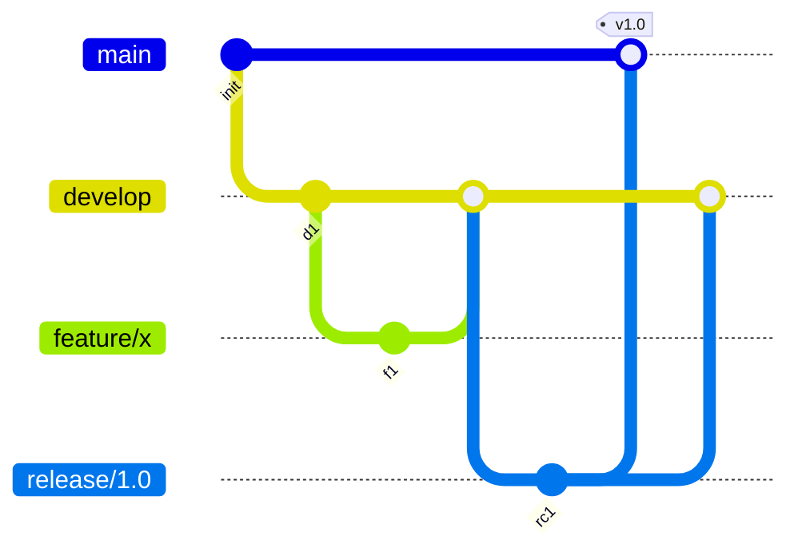

| Branch | Purpose |
|---|---|
| `main` | Always production-ready |
| `develop` | Integration branch for the next release |
| `feature/*` | New features, branched from `develop` |
| `release/*` | Stabilize before shipping |
| `hotfix/*` | Emergency prod fixes, branched from `main` |

> **💡 Best for:** Products with scheduled releases (versioned software, mobile apps).

### 27.2 GitHub Flow (simpler)

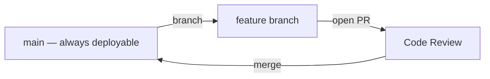

Just one rule: `main` is always deployable. Branch, commit, open a PR, review, merge, deploy.

> **💡 Best for:** Continuous deployment / SaaS products, small-to-medium teams.

### 27.3 GitLab Flow

A middle ground: GitHub Flow + environment branches (`main` → `pre-production` → `production`) for teams that need staged rollouts without full Git Flow complexity.

### 27.4 Trunk-Based Development

Everyone commits directly to `main` (or very short-lived branches, merged within a day), guarded by feature flags and heavy automated testing.

| | Git Flow | GitHub Flow | Trunk-Based |
|---|---|---|---|
| Branch lifespan | Long | Medium | Very short (hours) |
| Release cadence | Scheduled | Continuous | Continuous |
| Complexity | High | Low | Low (but needs strong CI + flags) |
| Best for | Versioned software | SaaS | High-velocity teams |

### 27.5 Monorepo Workflow

Single repo, multiple projects/packages. Relies heavily on:
- [Sparse checkout](#-22-sparse-checkout) & [partial clone](#262-partial-clone-blob-less)
- Path-based CI triggers (only test what changed)
- Tools: Nx, Turborepo, Bazel, Lerna

### 27.6 Feature Branch / Release / Hotfix Workflows

```bash
# Feature
git switch -c feature/checkout-redesign develop
# ... work, commit, push, PR into develop ...

# Release
git switch -c release/2.4.0 develop
# ... bump version, final QA fixes ...
git switch main && git merge --no-ff release/2.4.0 && git tag v2.4.0
git switch develop && git merge --no-ff release/2.4.0

# Hotfix
git switch -c hotfix/critical-auth-bug main
# ... fix, commit ...
git switch main && git merge --no-ff hotfix/critical-auth-bug && git tag v2.4.1
git switch develop && git merge --no-ff hotfix/critical-auth-bug
```

[⬆️ Back to Top](#-the-complete-git--github-mastery-guide)

---

## 🔄 28. CI/CD Integration

### 28.1 GitHub Actions

```yaml
name: Deploy
on:
  push:
    branches: [main]
jobs:
  build-and-deploy:
    runs-on: ubuntu-latest
    steps:
      - uses: actions/checkout@v4
      - run: npm ci && npm run build
      - name: Deploy
        run: ./deploy.sh
```

### 28.2 GitLab CI

`.gitlab-ci.yml`:
```yaml
stages: [test, build, deploy]

test:
  stage: test
  script: npm test

build:
  stage: build
  script: npm run build

deploy:
  stage: deploy
  script: ./deploy.sh
  only: [main]
```

### 28.3 Azure DevOps

`azure-pipelines.yml`:
```yaml
trigger: [main]
pool:
  vmImage: 'ubuntu-latest'
steps:
  - script: npm install && npm test
    displayName: 'Install & Test'
```

### 28.4 Jenkins

`Jenkinsfile`:
```groovy
pipeline {
    agent any
    stages {
        stage('Checkout') { steps { git 'https://github.com/user/repo.git' } }
        stage('Build') { steps { sh 'npm install && npm run build' } }
        stage('Test') { steps { sh 'npm test' } }
    }
}
```

> **✅ Best Practice:** Trigger CI on every PR (not just `main`) so problems are caught **before** merge, not after.

[⬆️ Back to Top](#-the-complete-git--github-mastery-guide)

---

## ✅ 29. Best Practices

### 29.1 Commit Message Conventions — Conventional Commits

```
<type>(<optional scope>): <short summary>

<optional body>

<optional footer(s)>
```

| Type | Use For |
|---|---|
| `feat` | A new feature |
| `fix` | A bug fix |
| `docs` | Documentation only |
| `style` | Formatting, no logic change |
| `refactor` | Code change that isn't a fix or feature |
| `test` | Adding/fixing tests |
| `chore` | Build process, tooling, dependencies |
| `perf` | Performance improvement |
| `ci` | CI configuration changes |

**Examples:**
```
feat(auth): add JWT refresh token support
fix(cart): prevent negative quantity values
docs(readme): add installation troubleshooting section
chore(deps): bump react from 18.2.0 to 18.3.0
```

> **💡 Why it matters:** Conventional Commits enable **automated changelog generation** and **Semantic Versioning** bumps (`feat` → minor, `fix` → patch, `BREAKING CHANGE:` footer → major).

### 29.2 Semantic Versioning (SemVer)

```
MAJOR.MINOR.PATCH   e.g. 2.4.1

MAJOR — incompatible / breaking API changes
MINOR — new functionality, backward-compatible
PATCH — backward-compatible bug fixes
```

### 29.3 Branch Naming — see [6.5](#65-branch-naming-conventions)

### 29.4 Repository Structure

```
project-root/
├── .github/
│   ├── workflows/
│   ├── ISSUE_TEMPLATE/
│   └── PULL_REQUEST_TEMPLATE.md
├── src/
├── tests/
├── docs/
├── .gitignore
├── .gitattributes
├── LICENSE
├── CONTRIBUTING.md
├── CODE_OF_CONDUCT.md
└── README.md
```

### 29.5 Security Practices

- ✅ Never commit `.env`, credentials, or private keys — use `.gitignore` from day one
- ✅ Enable secret scanning & Dependabot
- ✅ Require signed commits on protected branches for sensitive projects
- ✅ Rotate any credential that was ever accidentally committed, even after removing it from history
- ✅ Use branch protection rules: require PR reviews, passing CI, no force-push to `main`

### 29.6 General Golden Rules

| Rule | Why |
|---|---|
| Commit early, commit often | Smaller commits are easier to review, revert, and bisect |
| One logical change per commit | Keeps `git log`, `blame`, and `revert` meaningful |
| Never rewrite public history | Rebasing/force-pushing shared branches breaks teammates |
| Write descriptive commit messages | Future-you (and teammates) will thank you |
| Pull before you push | Avoids unnecessary conflicts |
| Review your diff before committing | `git diff --staged` catches debug code & accidental files |

[⬆️ Back to Top](#-the-complete-git--github-mastery-guide)

---

## 🛠️ 30. Troubleshooting

<details>
<summary><strong>❌ "fatal: not a git repository"</strong></summary>

You're not inside a Git repo, or `.git` was deleted. Run `git init` (new) or re-clone.
</details>

<details>
<summary><strong>❌ "Please tell me who you are" (on first commit)</strong></summary>

```bash
git config --global user.name "Your Name"
git config --global user.email "you@example.com"
```
</details>

<details>
<summary><strong>❌ "failed to push some refs" / "Updates were rejected"</strong></summary>

The remote has commits you don't have locally.
```bash
git pull --rebase origin main
git push
```
</details>

<details>
<summary><strong>❌ Merge conflict — "Automatic merge failed"</strong></summary>

See full walkthrough in [7.4](#74-resolving-merge-conflicts). Edit conflicted files, `git add`, then `git commit` (or `git rebase --continue`).
</details>

<details>
<summary><strong>❌ "detached HEAD" state</strong></summary>

You checked out a commit/tag directly instead of a branch.
```bash
git switch -c new-branch-name    # save your work onto a real branch
# OR, if you don't need the changes:
git switch main
```
</details>

<details>
<summary><strong>❌ Accidentally committed to the wrong branch</strong></summary>

```bash
git reset --soft HEAD~1        # undo the commit, keep changes staged
git stash                       # stash them
git switch correct-branch
git stash pop
git commit -m "..."
```
</details>

<details>
<summary><strong>❌ "fatal: refusing to merge unrelated histories"</strong></summary>

```bash
git pull origin main --allow-unrelated-histories
```
</details>

<details>
<summary><strong>❌ Accidentally deleted a branch</strong></summary>

```bash
git reflog                       # find its last commit hash
git branch recovered-name <hash>
```
</details>

<details>
<summary><strong>❌ Large file rejected by GitHub (100 MB limit)</strong></summary>

Use [Git LFS](#-18-git-lfs-large-file-storage), or remove it from history with `git filter-repo`.
</details>

<details>
<summary><strong>❌ "Permission denied (publickey)" over SSH</strong></summary>

```bash
ssh -T git@github.com     # test connection
ssh-add ~/.ssh/id_ed25519  # ensure key is loaded in agent
```
Confirm the public key is added to your GitHub account.
</details>

<details>
<summary><strong>❌ Line ending issues (CRLF/LF) between Windows & Mac/Linux</strong></summary>

```bash
git config --global core.autocrlf input   # Mac/Linux
git config --global core.autocrlf true     # Windows
```
Or standardize via `.gitattributes`: `* text=auto eol=lf`
</details>

<details>
<summary><strong>❌ "Your branch is ahead/behind 'origin/main' by N commits"</strong></summary>

Informational — run `git push` (ahead) or `git pull` (behind) as needed.
</details>

[⬆️ Back to Top](#-the-complete-git--github-mastery-guide)

---

## 🎤 31. Interview Questions

### 31.1 Beginner

<details>
<summary><strong>Q: What is the difference between Git and GitHub?</strong></summary>

Git is a distributed version control **tool** that runs locally. GitHub is a **cloud platform** that hosts Git repositories and adds collaboration features (PRs, Issues, Actions). Git works fully without GitHub.
</details>

<details>
<summary><strong>Q: What's the difference between `git fetch` and `git pull`?</strong></summary>

`fetch` downloads new data from the remote without touching your working directory or branches. `pull` is `fetch` + `merge` (or `rebase`) in one step, updating your current branch immediately.
</details>

<details>
<summary><strong>Q: What is the staging area?</strong></summary>

An intermediate area (`git add`) where you build up the exact snapshot for your next commit, separate from your working directory.
</details>

<details>
<summary><strong>Q: How do you undo the last commit?</strong></summary>

`git reset --soft HEAD~1` (keep changes staged) or `git revert HEAD` (safe, creates a new undo commit — appropriate if already pushed).
</details>

### 31.2 Intermediate

<details>
<summary><strong>Q: Explain the difference between merge and rebase.</strong></summary>

Merge combines two branches' histories with a new merge commit, preserving exact history. Rebase replays your commits on top of another branch, producing a linear history but rewriting commit hashes — unsafe on shared branches.
</details>

<details>
<summary><strong>Q: What is a detached HEAD?</strong></summary>

When `HEAD` points directly at a commit instead of a branch (e.g. after `git checkout <hash>`). New commits made here aren't attached to any branch and can be lost unless you create one.
</details>

<details>
<summary><strong>Q: How would you find which commit introduced a bug?</strong></summary>

`git bisect` (binary search through history) or `git log -S"<string>"` (pickaxe search) to find when specific code was introduced or removed.
</details>

<details>
<summary><strong>Q: What does `git reset --mixed` do (the default mode)?</strong></summary>

Moves `HEAD` and the branch pointer, and un-stages changes — but leaves your working directory files untouched.
</details>

### 31.3 Advanced

<details>
<summary><strong>Q: Explain how Git stores data internally (objects).</strong></summary>

Git is a content-addressable filesystem storing four object types — blobs (file content), trees (directory structure), commits (snapshot + metadata), and tags — each identified by a SHA hash of its content. Commits form a DAG (directed acyclic graph) via parent pointers.
</details>

<details>
<summary><strong>Q: What's the difference between `git merge --squash` and a regular merge?</strong></summary>

`--squash` combines all commits from the source branch into a single set of changes staged on the target, but does **not** create a merge commit or preserve the branch's individual commit history/parent links — you must run `git commit` yourself.
</details>

<details>
<summary><strong>Q: How do you remove a file containing a secret from your entire Git history?</strong></summary>

Use `git filter-repo` (or legacy `filter-branch`) to rewrite every commit removing the file, then force-push and have all collaborators re-clone. Critically, also **rotate the leaked credential** — history rewriting doesn't undo prior exposure.
</details>

<details>
<summary><strong>Q: What is the reflog and how long does it persist?</strong></summary>

A local, chronological log of every movement of `HEAD` (commits, resets, checkouts, rebases). Reachable entries expire after 90 days by default, unreachable ones after 30 — it's the primary recovery mechanism for "lost" commits.
</details>

<details>
<summary><strong>Q: `--force` vs `--force-with-lease` — why does the difference matter?</strong></summary>

`--force` overwrites the remote branch unconditionally, potentially destroying teammates' commits you haven't fetched. `--force-with-lease` checks that the remote ref hasn't changed since your last fetch and aborts if it has — safer for collaborative branches.
</details>

[⬆️ Back to Top](#-the-complete-git--github-mastery-guide)

---

## 🗒️ 32. Cheat Sheets

### 32.1 Daily Driver Commands

| Task | Command |
|---|---|
| Check status | `git status` |
| Stage changes | `git add .` |
| Commit | `git commit -m "message"` |
| Push | `git push` |
| Pull | `git pull` |
| Create + switch branch | `git switch -c branch-name` |
| Switch branch | `git switch branch-name` |
| Merge | `git merge branch-name` |
| View history | `git log --oneline --graph --all` |
| Stash | `git stash` / `git stash pop` |
| Discard changes | `git restore file` |
| Undo last commit (keep changes) | `git reset --soft HEAD~1` |

### 32.2 Full Quick-Reference Table

| Category | Command | Purpose |
|---|---|---|
| Setup | `git config --global user.name "X"` | Set identity |
| Setup | `git init` | New repo |
| Setup | `git clone <url>` | Copy repo |
| Stage | `git add <file>` / `git add .` | Stage changes |
| Commit | `git commit -m "msg"` | Save snapshot |
| Commit | `git commit --amend` | Edit last commit |
| Inspect | `git status` | Working tree state |
| Inspect | `git diff` | Unstaged changes |
| Inspect | `git log` | History |
| Inspect | `git show <hash>` | Commit details |
| Branch | `git branch` | List branches |
| Branch | `git switch -c <name>` | Create + switch |
| Branch | `git branch -d <name>` | Delete (safe) |
| Merge | `git merge <branch>` | Combine branches |
| Rebase | `git rebase <branch>` | Replay commits |
| Rebase | `git rebase -i HEAD~n` | Edit history |
| Remote | `git remote -v` | List remotes |
| Remote | `git fetch` | Download refs |
| Remote | `git pull` | Fetch + merge |
| Remote | `git push` | Upload commits |
| Undo | `git restore <file>` | Discard changes |
| Undo | `git reset --hard <hash>` | Reset everything ⚠️ |
| Undo | `git revert <hash>` | Safe undo (new commit) |
| Undo | `git reflog` | Recovery log |
| Stash | `git stash` | Save WIP |
| Stash | `git stash pop` | Restore WIP |
| Tags | `git tag -a v1.0 -m "msg"` | Annotated tag |
| Search | `git log -S"text"` | Pickaxe search |
| Search | `git blame <file>` | Line authorship |
| Search | `git bisect start` | Binary search bug |
| Clean | `git clean -fd` | Remove untracked |
| Maintenance | `git gc` | Garbage collect |

### 32.3 Decision Tree — "Which Undo Command Do I Need?"

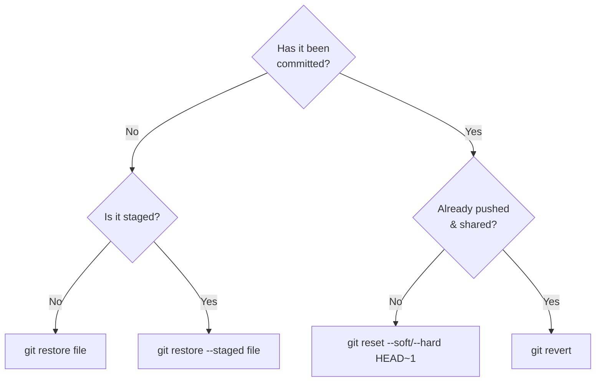

### 32.4 Decision Tree — "Merge or Rebase?"

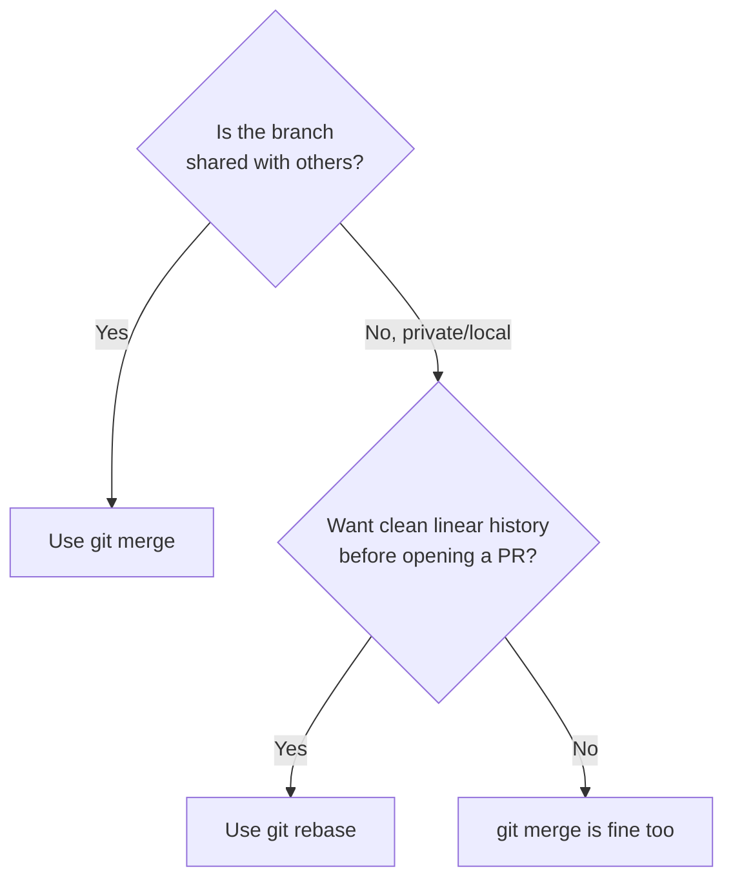

[⬆️ Back to Top](#-the-complete-git--github-mastery-guide)

---

## 📊 33. Visual Diagrams

### 33.1 Complete Git Workflow

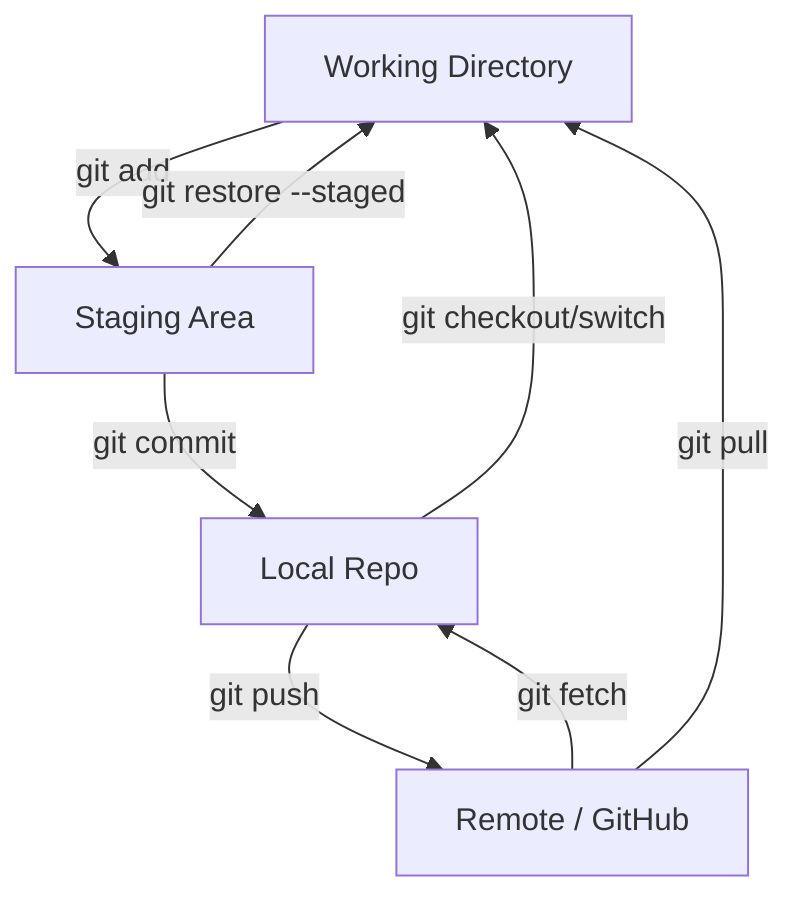

### 33.2 Branching Model

```mermaid
gitGraph
    commit id: "1"
    commit id: "2"
    branch develop
    commit id: "3"
    branch feature/a
    commit id: "4"
    commit id: "5"
    checkout develop
    merge feature/a
    checkout main
    merge develop tag: "v1.0"
```

### 33.3 HEAD, Branch, and Commit Relationship

```mermaid
graph LR
    HEAD -->|points to| main
    main -->|points to| C3["Commit C3"]
    C3 --> C2["Commit C2"]
    C2 --> C1["Commit C1"]
```

### 33.4 Remote Tracking Relationship

```mermaid
graph LR
    subgraph Local Machine
    L[main] --- LT["origin/main<br/>(remote-tracking branch)"]
    end
    subgraph GitHub
    R[main]
    end
    LT -.->|git fetch| R
    L -->|git push| R
```

### 33.5 Commit Graph With Merge

```mermaid
graph TD
    M["Merge Commit<br/>(2 parents)"] --> A["Commit A (main)"]
    M --> B["Commit B (feature)"]
    A --> Root["Common Ancestor"]
    B --> Root
```

[⬆️ Back to Top](#-the-complete-git--github-mastery-guide)

---

## 🎬 34. Real-World Scenarios

### 34.1 Starting a Brand-New Project

```bash
mkdir my-project && cd my-project
git init
echo "node_modules/" > .gitignore
git add .
git commit -m "chore: initial commit"
gh repo create my-project --public --source=. --push
```

### 34.2 Joining an Existing Project

```bash
git clone git@github.com:company/project.git
cd project
git switch -c feature/my-first-task
# ... work ...
git add .
git commit -m "feat: implement first task"
git push -u origin feature/my-first-task
gh pr create
```

### 34.3 Fixing a Bug

```bash
git switch -c fix/cart-total-calculation main
# ... fix bug, write a regression test ...
git add .
git commit -m "fix(cart): correct tax calculation rounding error"
git push -u origin fix/cart-total-calculation
gh pr create --title "Fix cart tax rounding" --body "Closes #88"
```

### 34.4 Emergency Hotfix to Production

```bash
git switch -c hotfix/payment-crash main
# ... minimal, surgical fix ...
git commit -am "fix(payments): prevent crash on null card token"
git push -u origin hotfix/payment-crash
gh pr create --base main
# after merge & deploy:
git tag -a v2.4.1 -m "Hotfix: payment crash"
git push origin v2.4.1
git switch develop && git merge --no-ff main    # bring the fix back into develop
```

### 34.5 Cutting a Release

```bash
git switch -c release/2.5.0 develop
# bump version numbers, final QA
git switch main
git merge --no-ff release/2.5.0
git tag -a v2.5.0 -m "Release 2.5.0"
git push origin main --tags
git switch develop
git merge --no-ff release/2.5.0
git branch -d release/2.5.0
```

### 34.6 Rolling Back a Bad Deploy

```bash
# Safe way — new commit that undoes the bad one, works even if already pushed
git revert <bad-commit-hash>
git push
```

### 34.7 Contributing to Open Source (Fork Workflow)

```bash
gh repo fork owner/project --clone
cd project
git remote add upstream https://github.com/owner/project.git
git switch -c feature/add-dark-mode
# ... make your change ...
git commit -am "feat: add dark mode toggle"
git push -u origin feature/add-dark-mode
gh pr create --repo owner/project
# keep your fork updated:
git fetch upstream
git switch main
git merge upstream/main
git push origin main
```

### 34.8 Resolving a Merge Conflict End-to-End

```bash
git switch feature/pricing
git merge main
# CONFLICT (content): Merge conflict in pricing.js
# edit pricing.js, remove <<<<<<<, =======, >>>>>>> markers
git add pricing.js
git commit
git push
```

### 34.9 Recovering a Deleted Commit

```bash
git reflog
# find: h7i8j9k HEAD@{3}: commit: Add checkout validation
git branch recovered-work h7i8j9k
git switch recovered-work
# cherry-pick what you need back into your real branch
```

### 34.10 Undoing "I Committed to `main` by Mistake"

```bash
git branch feature/oops-work        # snapshot current state onto a new branch
git switch main
git reset --hard origin/main         # restore main to match remote
git switch feature/oops-work          # continue your work safely here
```

[⬆️ Back to Top](#-the-complete-git--github-mastery-guide)

---

## 🔗 35. Resources

| Resource | Link |
|---|---|
| 📘 Official Git Documentation | [git-scm.com/doc](https://git-scm.com/doc) |
| 📗 Pro Git Book (free, excellent) | [git-scm.com/book](https://git-scm.com/book/en/v2) |
| 🐙 GitHub Docs | [docs.github.com](https://docs.github.com) |
| 🧵 Atlassian Git Tutorials | [atlassian.com/git](https://www.atlassian.com/git) |
| 🎮 Learn Git Branching (interactive) | [learngitbranching.js.org](https://learngitbranching.js.org) |
| 🧪 GitHub Skills (interactive courses) | [skills.github.com](https://skills.github.com) |
| 📝 Conventional Commits spec | [conventionalcommits.org](https://www.conventionalcommits.org) |
| 🔢 Semantic Versioning spec | [semver.org](https://semver.org) |
| 🙈 gitignore templates | [github.com/github/gitignore](https://github.com/github/gitignore) |
| 🎥 Git & GitHub crash courses | Search "Git full course" on YouTube (freeCodeCamp, Fireship, Traversy Media are excellent starting points) |

> **💡 Tip:** [Oh My Git!](https://ohmygit.org) is a free open-source *game* that teaches Git internals visually — highly recommended alongside this README.

[⬆️ Back to Top](#-the-complete-git--github-mastery-guide)

---

## 👤 36. Author

<div align="center">

### Maintained with ❤️ by **Atia**

*Engineer, builder, and lifelong learner — turning complex topics into clear, practical guides.*


*(Replace the badges above with your actual profile links.)*

</div>

### 🙏 Acknowledgements

- The **Git** open-source community and Linus Torvalds, for building the tool this entire guide is about
- **GitHub, GitLab, and Atlassian**, for world-class official documentation that informed this guide's structure
- Every contributor who submits a fix, clarification, or new example to this repository

### 🤝 Contributing

Contributions are welcome! To propose a change:

```bash
git clone https://github.com/your-username/git-mastery-guide.git
git switch -c improve/section-name
# make your edits to README.md
git commit -m "docs: improve explanation of rebase section"
git push -u origin improve/section-name
# open a Pull Request
```

Please keep additions consistent with the existing tone: **beginner-friendly, example-driven, and precise.**

### 📄 License

This project is licensed under the **MIT License** — free to use, share, and adapt with attribution.

```
MIT License

Copyright (c) 2026

Permission is hereby granted, free of charge, to any person obtaining a copy
of this software and associated documentation files (the "Software"), to deal
in the Software without restriction, including without limitation the rights
to use, copy, modify, merge, publish, distribute, sublicense, and/or sell
copies of the Software, subject to the following conditions:

The above copyright notice and this permission notice shall be included in all
copies or substantial portions of the Software.

THE SOFTWARE IS PROVIDED "AS IS", WITHOUT WARRANTY OF ANY KIND, EXPRESS OR
IMPLIED, INCLUDING BUT NOT LIMITED TO THE WARRANTIES OF MERCHANTABILITY,
FITNESS FOR A PARTICULAR PURPOSE AND NONINFRINGEMENT.
```

---

<div align="center">

### ⭐ If this guide helped you, consider giving the repository a star!

**[⬆️ Back to Top](#-the-complete-git--github-mastery-guide)**

</div>
